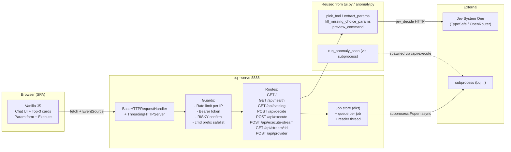

# PRD-chat: `bq --serve PORT` — Jev Web Chat Mode

> **Version:** 1.0
> **Last Updated:** 2026-10-02
> **Target build-q:** v0.1.42+
> **Modules:**
> - [`build_q/serve.py`](file:///Users/mamatnurahmat/build-q/build_q/serve.py) — HTTP server + 7 routes
> - [`build_q/serve_assets.py`](file:///Users/mamatnurahmat/build-q/build_q/serve_assets.py) — inline HTML+CSS+JS SPA
> **CLI Entry:** `bq --serve PORT [--serve-host HOST] [--serve-token TOKEN] [--serve-no-exec]`

---

## 1. Ringkasan

`bq --serve` membuka **Jev Agent Planner sebagai web chat** di port yang dipilih. Memakai 100% logic `tui.py` (pick_tool, extract_params, fill_missing_choice_params, risk classification) — web layer hanya thin adapter. Zero new runtime deps (stdlib `http.server` + Server-Sent Events).

```bash
bq --serve 8888
# → http://127.0.0.1:8888
```

Buka browser → tulis request natural (`"bootstrap pay-be-topup develop ke gitops cce production-qoin replicas 3"`) → Jev suggest tool + fill parameter → preview command → klik **Jalankan** → streaming output real-time.

## 2. Problem Statement

TUI terminal-only (`bq --tui`) tidak scalable:
- Butuh install `bq` + pipx + env di tiap laptop
- Tidak accessible dari mobile (on-call) atau tablet
- Output panjang susah di-copy, susah di-share screenshot
- Tim non-DevOps (QA, PM) sulit onboarding command line
- Tidak ada export riwayat percakapan untuk audit/post-mortem

Web chat menyelesaikan semua ini dengan **satu URL** (`http://devops-tools:8888`), bisa dibuka dari browser mana pun, dan reuse infrastruktur Jev yang sudah terbukti.

## 3. Goals & Non-goals

### Goals
- **Zero new runtime deps** (stdlib `http.server`, `queue`, `threading`, `subprocess`) — konsisten dgn prinsip minimal-deps `bq`.
- **Reuse 100% `tui.py`** — tidak ada duplikasi decision pipeline.
- **RISKY-aware**: default confirm button; server-side guard refuse `/api/execute` tanpa `confirm=true`.
- **Localhost-first**: default bind `127.0.0.1`; `--serve-host 0.0.0.0` eksplisit + warning + sarankan `--serve-token`.
- **Streaming output** via SSE (bukan WebSocket — menghindari dep `websockets`).
- **Audit log** append-only ke `~/.build-q/.serve-audit.log` (semua decide + execute).
- **Companion katalog**: register `bq_serve` sebagai tool di PB `build_q_tools` — `bq --tui` bisa suggest `/serve` dirinya sendiri (meta-recursive 😄).

### Non-goals
- Bukan multi-tenant SaaS. Single-user, local-first (atau small team dgn shared token).
- Bukan auth lengkap (OAuth, SSO). Hanya optional Bearer token.
- Bukan persistent chat history (in-memory per-session; export .md manual).
- Bukan WebSocket (SSE cukup untuk pola request-response + stream subprocess).
- Bukan file upload / sharing (semua interaksi lewat command text).

## 4. Personas

- **Backend engineer** on-call yang perlu rebuild cepat dari mobile saat insiden produksi.
- **DevOps lead** yang ingin share Jev ke tim non-CLI (QA, PM) via URL internal.
- **AI agent / automation** yang perlu HTTP API ke Jev tanpa spawn CLI subprocess per request.
- **New team member** yang belum install `bq` di laptop tapi perlu akses tool DevOps.

## 5. Architecture



### 5.1 Request Flow — Sync vs Stream

**Sync (M1)** — untuk CI, curl, otomatisasi:
```
POST /api/execute   → block ~N second → {exit, stdout, stderr}
```

**Async + stream (M2)** — untuk browser:
```
POST /api/execute-stream   → {job_id, stream_url}
GET  /api/stream/:job_id   → SSE text/event-stream
                              data: {"line": "..."}  (per baris)
                              event: done
                              data: {"exit": 0, "elapsed_s": 1.2}
```

Browser pakai `EventSource(stream_url)` — native API, reconnect otomatis bila disconnect.

## 6. API Reference

| Method | Path | Request Body | Response | Auth |
|---|---|---|---|---|
| GET | `/` | — | `text/html` (SPA) | optional |
| GET | `/api/health` | — | `{version, provider, auth_required, allow_exec, host}` | required if token |
| GET | `/api/catalog` | — | `{tools, providers, patterns}` (ringkas) | required if token |
| POST | `/api/decide` | `{user_msg, provider?}` | `{tool, confidence, top3, params, preview, risky, usage, params_schema}` | required if token |
| POST | `/api/execute` | `{cmd, risky, confirm}` | `{job_id, exit, stdout, stderr, elapsed_s}` | required if token |
| POST | `/api/execute-stream` | `{cmd, risky, confirm}` | `{job_id, stream_url}` | required if token |
| GET | `/api/stream/:id` | — | `text/event-stream` | required if token (`?token=X` fallback) |
| POST | `/api/provider` | `{name}` | `{ok, provider}` | required if token |

### Error codes

| HTTP | Reason |
|---|---|
| 400 | Bad body (missing field, RISKY tanpa confirm, cmd tidak diawali `bq ` / `python3 -m `) |
| 401 | Missing/invalid Bearer token |
| 403 | `/api/execute` saat `--serve-no-exec` aktif |
| 404 | Route tidak dikenal / job_id tidak ada |
| 429 | Rate limit (default 120 req/menit per IP untuk `/api/*`) |
| 500 | Jev error / executable not found |
| 504 | Subprocess timeout (default 180s) |

## 7. Security Model

| Risk | Mitigasi | Default |
|---|---|---|
| Remote exec via exposed port | Bind `127.0.0.1`; warning + token recommend saat `0.0.0.0` | localhost |
| RISKY auto-run | Server guard: refuse execute kalau `risky && !confirm` | enforced |
| Credential leak via UI | API key masked (`sk-xxx…xxx`); env var tidak dikirim ke browser | enforced |
| Arbitrary shell injection | Allowlist: cmd harus diawali `bq ` atau `python3 -m ` | enforced |
| Prompt injection via chat | Sama dengan TUI (constrained choice katalog) — Jev tidak bisa return tool yg tidak ada | enforced |
| DoS flood | Rate limit per-IP 120 req/menit untuk `/api/*` | enforced |
| Audit gap | Append-only JSON log `~/.build-q/.serve-audit.log` (decide, execute, auth_fail, abort) | enforced |
| Unauth access via LAN | Optional `--serve-token TOKEN` — Bearer di Authorization header (query-string untuk EventSource) | opt-in |
| Browser cache katalog stale | Response header `Cache-Control: no-store` untuk `/api/*` | enforced |

### Token flow
```bash
# Server
bq --serve 8888 --serve-host 0.0.0.0 --serve-token s3cr3t-dev-token

# Browser URL (sekali bootstrap, token disimpan di localStorage)
http://10.1.2.3:8888/?token=s3cr3t-dev-token

# Curl / CI
curl -H 'Authorization: Bearer s3cr3t-dev-token' http://10.1.2.3:8888/api/health
```

## 8. CLI Flags

| Flag | Default | Keterangan |
|---|---|---|
| `--serve PORT` | — | Buka server di `PORT` |
| `--serve-host HOST` | `127.0.0.1` | Bind address. `0.0.0.0` → expose LAN |
| `--serve-token TOKEN` | — | Wajib Bearer token untuk `/api/*` |
| `--serve-no-exec` | false | Read-only / demo mode: tolak `/api/execute` |

## 9. UI Features (M4 polish)

- **Chat history** scrollable, bubble user vs bot
- **Top-3 cards** dengan progress bar visual + highlight winner
- **Param form** auto-generate dari schema tool (text input / choice dropdown)
- **Live preview** command update real-time saat edit parameter
- **Execute button** merah `[RISKY]` kalau destructive
- **Streaming output** via SSE, auto-scroll ke bawah
- **Rerun button** per output panel
- **Export chat** button → download `jev-chat-{timestamp}.md`
- **Clear chat** button (confirm dulu)
- **Provider switcher** di header dropdown
- **Token usage** footer per response (hemat cost awareness)
- **Status bar** header: version · provider · model
- **Theme**: dark-mode GitHub (konsisten dgn CLI muted palette)

## 10. Observability

- **Audit log** `~/.build-q/.serve-audit.log` — JSON lines:
  ```json
  {"ts": "2026-10-02T10:02:02", "event": "decide", "user_msg": "...", "tool": "bq_pb_status", "confidence": 1.0, "risky": false}
  {"ts": "2026-10-02T10:02:27", "event": "execute", "job_id": "c09ca0e82c40", "cmd": "bq --version", "exit": 0, "elapsed_s": 0.07, "risky": false}
  {"ts": "2026-10-02T10:03:10", "event": "auth_fail", "path": "/api/decide", "ip": "10.1.2.3"}
  {"ts": "2026-10-02T10:04:15", "event": "execute_stream_abort", "job_id": "ab12..."}
  ```
- **Job state** in-memory dict, auto-reap >600s setelah done.
- **Token usage** per decide call forwarded dari provider (TypeSafe/OpenRouter) ke UI footer.

## 11. Deployment Options

### A. Localhost (default, paling aman)
```bash
bq --serve 8888
```
Hanya accessible dari laptop sendiri. Zero config.

### B. LAN internal (tim DevOps)
```bash
bq --serve 8888 --serve-host 0.0.0.0 --serve-token "$(openssl rand -hex 16)"
```
Share token via Slack DM / 1Password. Firewall harus block dari internet.

### C. Behind reverse proxy (nginx)
```nginx
location /jev/ {
    proxy_pass http://127.0.0.1:8888/;
    proxy_buffering off;              # penting untuk SSE
    proxy_set_header X-Accel-Buffering no;
    proxy_read_timeout 300s;          # untuk long-running cmd
}
```
Pakai mTLS atau Cloudflare Access untuk auth lebih kuat.

### D. Demo mode (public showcase)
```bash
bq --serve 8888 --serve-no-exec
```
Decide tetap jalan (user bisa lihat Top-3 + preview), tapi `/api/execute` return 403.

## 12. Current State (v0.1.42)

| Metric | Value |
|---|---|
| Routes | 8 (3 GET + 5 POST) |
| Server LOC | ~450 (`serve.py`) |
| UI LOC | ~300 (`serve_assets.py`, inline) |
| New deps | 0 (zero) |
| M1 (MVP core) | ✅ |
| M2 (SSE stream) | ✅ |
| M3 (Token auth + rate limit) | ✅ |
| M4 (UX polish — export/rerun/clear) | ✅ |
| M5 (Hardening) | ✅ |
| M6 (PB katalog + PRD) | ✅ |

## 13. Roadmap

| Prio | Fitur | Rationale |
|---|---|---|
| P1 | Persistent chat history (SQLite `~/.build-q/.serve-history.db`) | Audit panjang + resume session |
| P1 | PR bot integration (`bq --serve-pr` listen GitHub webhook) | Comment anomaly scan hasil otomatis di PR |
| P2 | Multi-user with per-session JWT | Replace shared token |
| P2 | OpenAPI 3 spec export (`/api/openapi.json`) | Auto-generate client SDK |
| P3 | Multi-step planning (chain 2+ tools) | Konsistensi dgn TUI roadmap item serupa |
| P3 | Prometheus metrics `/metrics` | Monitor Jev decision latency, token spend |
| P3 | Grafana dashboard template | Operational insight tim besar |

## 14. Related Documents

- [`PRD.md`](file:///Users/mamatnurahmat/build-q/PRD.md) — PRD utama `build-q`
- [`PRD-tui.md`](file:///Users/mamatnurahmat/build-q/PRD-tui.md) — PRD Jev TUI (sibling, terminal-mode)
- [`PRD-bootstrap-k8s.md`](file:///Users/mamatnurahmat/build-q/PRD-bootstrap-k8s.md)
- [`scripts/build-q-seed.json`](file:///Users/mamatnurahmat/build-q/scripts/build-q-seed.json) — katalog PB termasuk `bq_serve`

## 15. Changelog

| Tanggal | Version | Perubahan |
|---|---|---|
| 2026-10-02 | 1.0 | Dokumen awal — M1-M6 complete di v0.1.42. |
