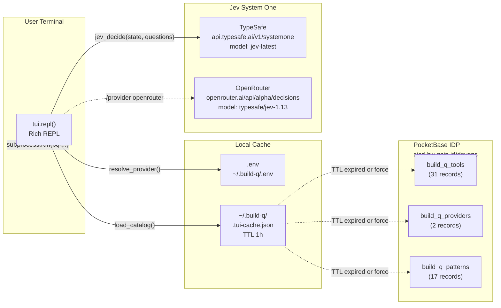
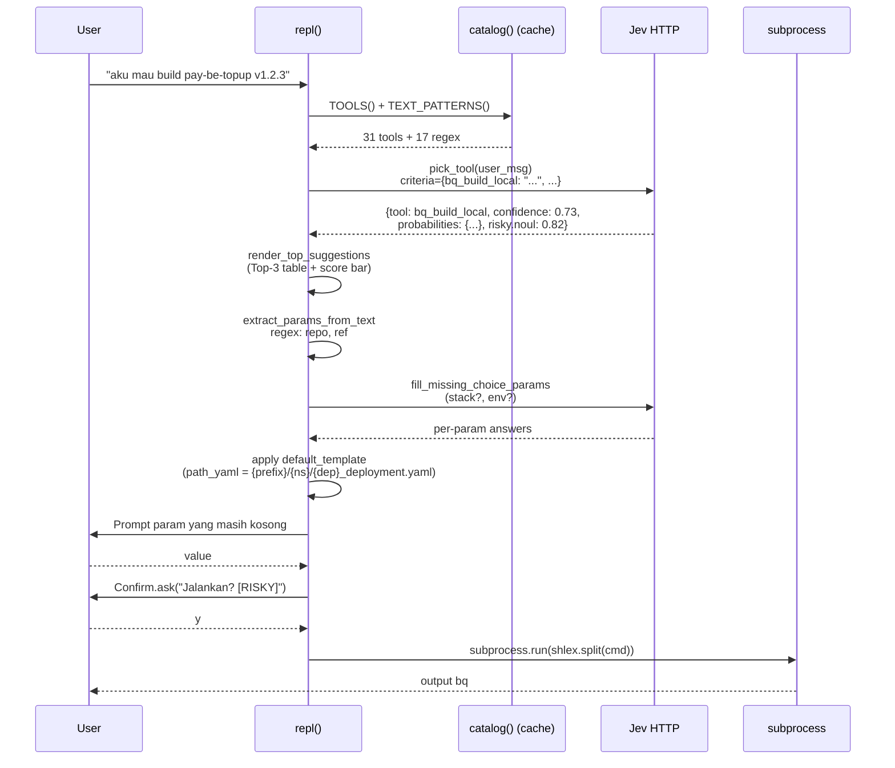

# PRD: `bq --tui` — Jev Agent Planner (System One)

> **Version:** 1.0
> **Last Updated:** 2026-10-02
> **Target build-q:** v0.1.40+
> **Modules:**
> - [`build_q/tui.py`](file:///Users/mamatnurahmat/build-q/build_q/tui.py) — REPL + Jev HTTP client
> - [`build_q/tui_catalog.py`](file:///Users/mamatnurahmat/build-q/build_q/tui_catalog.py) — PocketBase-backed catalog loader
> - [`scripts/build-q-seed.json`](file:///Users/mamatnurahmat/build-q/scripts/build-q-seed.json) — seed data (tools + providers + patterns)
> **CLI Entry:** `bq --tui` · `bq --tui-pull` · `bq --tui-sync <seed.json>` · `bq --tui-ls`

---

## 1. Ringkasan

**Jev Agent Planner** adalah TUI (text UI) interaktif di dalam `bq` yang menerjemahkan **permintaan natural language** (ID/EN) engineer → **perintah `bq` konkret** yang siap dieksekusi. Penerjemahan dilakukan oleh **System One (Jev)** — model TypeSafe/OpenRouter yang mengembalikan **keputusan terstruktur** (choice + probabilitas) alih-alih free-form text. Konsekuensinya: output selalu valid-schema, dapat di-score, dan dapat di-render sebagai Top-3 kandidat sebelum eksekusi.

### Contoh Sesi

```
$ bq --tui

╭─ Jev Agent Planner  provider=typesafe model=jev-latest ─╮
│ Ketik request natural (ID/EN). Jev akan usulkan top-3  │
│ perintah + skor kecocokan.                             │
│ /help daftar perintah TUI                              │
╰─────────────────────────────────────────────────────────╯

you: aku mau build pay-be-topup-manager tag v1.2.3

┌──── Top-3 Kandidat Perintah (skor kecocokan) ─────────────┐
│ #  Tool              Skor                   Contoh        │
│ 1  bq_build_local    █████████████░░░ 73%   bq pay-be-topup-manager v1.2.3 --local │
│ 2  bq_build_no_push  ██░░░░░░░░░░░░░░ 11%   bq pay-be-topup-manager v1.2.3 --local --no-push │
│ 3  bq_build_remote   █░░░░░░░░░░░░░░░ 8%    bq pay-be-topup-manager v1.2.3 --remote │
└───────────────────────────────────────────────────────────┘
→ Pilihan Jev: bq_build_local (confidence 73.1%) RISKY (destructive noul=0.82)

╭─ Perintah Final ──────────────────────────────────────╮
│ bq pay-be-topup-manager v1.2.3 --local               │
╰───────────────────────────────────────────────────────╯
Jalankan? (RISKY) [y/N]: _
```

### Apa yang Terjadi (Ringkas)

| Step | Aksi | Output |
|------|------|--------|
| 0 | Load `.env` + load catalog | Provider + 31 tools + 17 patterns dari PB |
| 1 | User ketik request | Natural text (ID/EN) |
| 2 | Jev `pick_tool`: pilih 1 dari 31 tools + noul risky | `{tool, confidence, probabilities, risky}` |
| 3 | Regex extract parameter dari pesan | `{repo, ref, env, …}` |
| 4 | Jev `fill_missing_choice_params` untuk param type=choice yang kosong | per-param choice answer |
| 5 | Apply `default_template` (param derivation chain) | `path_yaml`, `image`, … auto-derive |
| 6 | Prompt interaktif untuk param yang masih kosong | user melengkapi |
| 7 | Render preview + konfirmasi (default `n` bila RISKY) | user approve / skip |
| 8 | `subprocess.run(shlex.split(cmd))` | eksekusi perintah `bq` |

---

## 2. Problem Statement

Katalog `bq` sudah 60+ flag (lihat `bq --help`). Mengingat kombinasi `--bootstrap-k8s <repo> <ref> --gitops-repo … --gitops-branch … --path-yaml … --env … --kube-context …` sulit buat on-call engineer, apalagi pemula / AI agent. Pencarian via `--help | grep` lambat, dan **context switching** antara "apa yang mau saya lakukan" ↔ "flag mana yang harus saya pakai" rawan salah ketik.

Alternatif populer (LLM free-form chat) memiliki 3 kelemahan:
1. **Non-deterministic**: LLM bisa halusinasi flag yang tidak ada.
2. **Tidak dapat di-score**: tidak ada ranking antar kandidat.
3. **Tidak auditable**: output markdown panjang sulit dibandingkan.

Jev System One menyelesaikan ini dengan model **constrained-choice**: Jev tidak boleh mengembalikan tool yang tidak ada di criteria, dan setiap keputusan datang dengan `confidence` + `probabilities` yang bisa divisualkan.

---

## 3. Goals & Non-goals

### Goals
- **Zero hardcode**: katalog tool/provider/pattern 100% dari PocketBase (`build_q_tools` / `build_q_providers` / `build_q_patterns`).
- **Provider-agnostic**: dukung TypeSafe direct + OpenRouter via contract yang sama (`POST {url}` dengan body `{model, state, questions}`).
- **Risky-aware**: default confirm `n` untuk tool destruktif (apply, delete, sync, push, PR).
- **Explainable**: tampilkan Top-3 + score bar + preview command sebelum eksekusi.
- **Offline-resilient**: TTL 1 jam di `~/.build-q/.tui-cache.json`; bootstrap minimum bila PB down + cache kosong.
- **Admin-friendly**: `--tui-sync <seed.json>` upsert idempotent (lookup by `name`/`field`, PATCH if exist, POST otherwise).

### Non-goals
- Bukan **autonomous agent**: Jev tidak mengeksekusi apa-apa tanpa `Confirm.ask` dari user.
- Tidak melakukan **tool chaining** (satu request = satu tool). Multi-step flow di-handle oleh tool monolitik seperti `bq --pr-fix` yang sudah atomic.
- Tidak menyimpan **conversation state** — setiap turn adalah fresh decision tanpa memory.
- Tidak mengelola **secrets** sendiri — delegasi ke `pb_api.py` (collection `secrets`).

---

## 4. Personas

- **Backend engineer** yang hafal nama tools tapi lupa flag kombinasi (`--bootstrap-k8s + --kube-context + --nodepool`).
- **On-call engineer** jam 2 pagi yang butuh trigger rebuild cepat (`"trigger ulang pay-be-topup develop"`).
- **Pemula / AI agent** yang hanya tahu *intent* (`"cek image mismatch antara k8s dan gitops"`) tanpa tahu nama tool.
- **DevOps admin** yang perlu grow katalog tool via seed JSON tanpa menyentuh kode Python.

---

## 5. Architecture

### 5.1 Component Diagram



### 5.2 Data Flow — Satu Turn REPL



### 5.3 Katalog Schema (PocketBase)

#### `build_q_tools`

| Field | Type | Example | Notes |
|---|---|---|---|
| `name` | text (unique) | `bq_bootstrap_k8s` | Dipakai sebagai key TOOLS() dict |
| `category` | text | `k8s` | Group di `--tui-ls` |
| `description` | text | "Bootstrap manifest K8s …" | Dikirim ke Jev sebagai criteria |
| `template` | text | `bq --bootstrap-k8s {repo} {ref} --…` | `.format(**params)` |
| `params` | json | `{"repo":{"type":"text","hint":"..."}}` | Lihat §6 |
| `risky` | bool | `true` | → default confirm `n` + tag `RISKY` |
| `active` | bool | `true` | Fetch filter `active=true` |
| `order` | number | `18` | Sort key di render |

#### `build_q_providers`

| Field | Example | Notes |
|---|---|---|
| `name` | `typesafe` / `openrouter` | Dipakai `/provider <name>` |
| `url` | `https://api.typesafe.ai/v1/systemone` | Override via `{NAME}_URL` env |
| `model` | `jev-latest` | Override via `{NAME}_MODEL` env |
| `key_env` | `TYPESAFE_API_KEY` | Lookup di `os.environ` |
| `is_default` | `true` | Dipakai bila `JEV_PROVIDER` kosong |
| `active` | `true` | Filter fetch |

#### `build_q_patterns`

| Field | Example | Dipakai di |
|---|---|---|
| `field` | `repo` | Key di `extract_params_from_text` |
| `pattern` | `(?:pay\|plus\|…)-(?:be\|fe\|mono)-[\w-]+` | `re.search` di user_msg |
| `order` | `2` | Sort key |

---

## 6. Decision Pipeline

### 6.1 Jev HTTP Contract

Jev System One (TypeSafe & OpenRouter) menerima HTTP POST yang **identik**:

```http
POST {provider.url}
Authorization: Bearer {TYPESAFE_API_KEY | OPENROUTER_API_KEY}
Content-Type: application/json

{
  "model": "jev-latest",
  "state": {
    "user_request": "aku mau build pay-be-topup v1.2.3"
  },
  "questions": {
    "tool": {
      "type": "choice",
      "instructions": "Pilih 1 tool build-q paling cocok untuk request user.",
      "criteria": {
        "bq_build_local": "EKSEKUSI build image lokal via Docker buildx ...",
        "bq_bootstrap_k8s": "Bootstrap manifest K8s ke repo GitOps ...",
        ...,
        "none": "Tidak ada tool yang cocok untuk permintaan ini."
      }
    },
    "risky": {
      "type": "noul",
      "instructions": "Apakah tool ini bersifat destruktif / mengubah state?",
      "criteria": {
        "true":  "Tool mengubah state cluster/repo (apply, sync, delete, push).",
        "false": "Tool hanya read-only (list, cek status, ambil info)."
      }
    }
  }
}
```

Response:

```json
{
  "answers": {
    "tool": {
      "choice": "bq_build_local",
      "confidence": 0.731,
      "probabilities": {
        "bq_build_local": 0.731,
        "bq_build_no_push": 0.112,
        "bq_build_remote": 0.082,
        ...
      }
    },
    "risky": { "noul": 0.82 }
  },
  "usage": { "input_tokens": 1240, "output_tokens": 42, "cost": 0.0003 }
}
```

### 6.2 Parameter Extraction (3 Pass)

| Pass | Mekanisme | Contoh |
|---|---|---|
| **1a** | **Regex** (`TEXT_PATTERNS[field]`) | `v1.2.3` → `ref`, `pay-be-topup-manager` → `repo` |
| **1b** | **Word-match** untuk `type=choice` | `dotnet` → `stack=dotnet`, `production` → `env=production` |
| **2** | **`default_template`** chaining | `path_yaml = cce/{namespace}/{deployment}_deployment.yaml` → auto-derive setelah `namespace` & `deployment` terisi |
| **3** | **Jev `fill_missing_choice_params`** | Sisa param `choice` yang belum terisi dilempar balik ke Jev dengan criteria dari `options` |

Dan terakhir, **interactive prompt** untuk param yang masih berupa placeholder (`<name>`).

### 6.3 Risk Classification

Tool dianggap **RISKY** bila **salah satu** true:
1. `risky=true` di PB record (hard flag).
2. Jev `risky.noul >= 0.5` (model judgment berdasarkan deskripsi tool).

Konsekuensi RISKY:
- Tag `[red]RISKY[/red]` di verdict line.
- `Confirm.ask` default `n` (bukan `y`).
- Perintah dicetak di panel merah **sebelum** eksekusi.

---

## 7. CLI Admin Commands

### 7.1 `bq --tui`

Buka REPL. Load `.env` → resolve provider → render welcome panel. Loop sampai `/quit` / Ctrl+C / Ctrl+D.

### 7.2 `bq --tui-pull`

Force refresh cache dari PB (skip TTL). Berguna setelah admin menambah tool di PocketBase admin UI.

```
$ bq --tui-pull
✅ TUI catalog refreshed from PocketBase:
   tools    : 31
   providers: 2 (default: typesafe)
   patterns : 17
   risky    : 18
   cache    : /Users/mamatnurahmat/.build-q/.tui-cache.json
```

### 7.3 `bq --tui-sync <seed.json>`

Upload katalog dari file JSON ke PB — **upsert** (PATCH jika record `name`/`field` sudah ada, POST jika belum).

Format seed:

```json
{
  "build_q_tools":     [ {name, category, description, template, params, risky, active, order}, ... ],
  "build_q_providers": [ {name, url, model, key_env, is_default, active}, ... ],
  "build_q_patterns":  [ {field, pattern, active, order}, ... ]
}
```

Return summary: `created=N updated=M failed=K` per collection. Cache otomatis di-clear sehingga `bq --tui` berikutnya re-fetch.

### 7.4 `bq --tui-ls`

Tampilkan katalog aktif (dari cache + metadata source: `pb` / `cache` / `bootstrap`). Berguna untuk audit "apa saja yang Jev lihat sekarang".

```
📚 TUI catalog (source: pb, cache_age: 1s)
   default provider: typesafe

── Providers (2) ──
   ★ typesafe     jev-latest     url=https://api.typesafe.ai/v1/systemone
     openrouter   typesafe/jev-1.13   url=https://openrouter.ai/api/alpha/decisions

── Tools (31) ──
   [build]
     ⚠️ bq_build_local
     ✓ bq_build_no_push
     …
   [k8s]
     ⚠️ bq_bootstrap_k8s
     ⚠️ bq_set_image
     …
```

---

## 8. REPL Slash Commands

Perintah TUI (prefix `/`) tidak di-forward ke Jev, langsung di-handle `tui.handle_slash()`:

| Command | Fungsi |
|---|---|
| `/help` | Panel bantuan |
| `/tools` | Tabel lengkap katalog tool (name/desc/template) |
| `/provider` | Tampilkan provider aktif + URL + model + masked key |
| `/provider openrouter` | Switch runtime ke OpenRouter |
| `/provider typesafe` | Switch runtime ke TypeSafe direct |
| `/set KEY VALUE` | Set env var in-memory (mis. `/set OPENROUTER_API_KEY sk-or-…`) |
| `/save` | Persist `JEV_PROVIDER` + API key saat ini ke `~/.build-q/.env` |
| `/quit` / `/exit` / `/q` | Keluar REPL |

---

## 9. Provider Resolution

Prioritas (highest → lowest):

1. **Explicit arg**: `/provider <name>` saat sesi berlangsung.
2. **Env var**: `JEV_PROVIDER` di `.env` atau shell.
3. **PB default**: provider record dengan `is_default=true`.
4. **First record**: provider pertama dari iterasi dict.

Setelah provider resolve, `url` dan `model` dapat di-**override** per-provider via env:

```
TYPESAFE_URL=https://staging.typesafe.ai/v1/systemone  # override url untuk testing
TYPESAFE_MODEL=jev-1.14-preview
OPENROUTER_URL=…
OPENROUTER_MODEL=…
```

API key **wajib** di env dengan nama dari `key_env` (`TYPESAFE_API_KEY` atau `OPENROUTER_API_KEY`). Kalau kosong, `ensure_key()` raise RuntimeError sebelum HTTP call.

---

## 10. Fallback & Resilience Chain

Katalog loader (`tui_catalog.load_raw`) punya 5-level fallback:

| # | Kondisi | Aksi |
|---|---|---|
| 1 | Cache ada **dan** `TTL<1h` | Pakai cache (fast path, zero network) |
| 2 | Cache stale / absent, PB reachable | Fetch 3 collection → tulis cache → return |
| 3 | PB down, cache ada (stale) | Pakai cache stale + warning "umur Ns" |
| 4 | PB down, cache absent, `allow_fallback=True` | **Bootstrap minimum** (1 provider typesafe + 1 tool `bq_doctor`) agar `bq --tui` tetap jalan |
| 5 | PB down, cache absent, `allow_fallback=False` | Raise `CatalogError` |

TTL dapat diubah via `BUILD_Q_TUI_CACHE_TTL` (detik). `0` → selalu refresh.

---

## 11. Current Catalog State (v0.1.40 — 2026-10-02)

Total: **31 tools / 2 providers / 17 patterns** (sumber: PocketBase `cicd-hw.qoin.id/devops`).

### Tools per Kategori (8 kategori)

| Kategori | Tool(s) |
|---|---|
| **build** (7) | `bq_build_local` · `bq_build_no_push` · `bq_build_compose` · `bq_build_dry_run` · `bq_clone_build` · `bq_build_remote` · `bq_build_gh_auth` |
| **cicd** (3) | `bq_cicd_trigger` · `bq_cicd_webhook` · `bq_pr_fix` |
| **init** (6) | `bq_init_config` · `bq_init_jx` · `bq_init_legacy` · `bq_init_secrets` ⚰️ · `bq_gh_action_init` ⚰️ · `bq_fix_dockerfile` |
| **k8s** (4) | `bq_bootstrap_k8s` · `bq_set_image` · `bq_gitops_set_image` · `bq_is_match_image` |
| **preflight** (4) | `bq_doctor` · `bq_config_show` · `bq_check` · `bq_repo_check` |
| **pocketbase** (4) | `bq_pb_login` · `bq_pb_status` · `bq_pb_pull` · `bq_pb_logout` |
| **secrets** (2) | `bq_sops_encrypt` · `bq_sops_decrypt` |
| **companion** (1) | `drift_checker_worker` |

(⚰️ = DEPRECATED, keep active untuk legacy repo. Notes: `deprecated-fase3` — standar sekarang webhook `cicd-hw.qoin.id/hook`.)

### Risky Flag

**18 dari 31 tools** marked `risky=true` (apply, push, PR, cluster-mutate, SOPS encrypt, PB logout). Default REPL confirm `n` untuk ini.

### Patterns Aktif (17)

`app` · `branch` · `deployment` · `env` · `image` · `kube_context` · `namespace` · `owner_repo` · `partial_file` · `path` · `path_yaml` · `pod` · `ref` · `replicas` · `repo` · `stack` · `tag`

---

## 12. End-to-End Example: Bootstrap K8s via Jev

**User input (natural language)**:

```
you: bootstrap pay-be-topup develop ke gitops cce production-qoin, replicas 3
```

**Step-by-step**:

1. **Jev `pick_tool`** → `bq_bootstrap_k8s` (confidence 0.84, risky.noul=0.91)
2. **Regex extract** (`extract_params_from_text`):
   - `repo` → `pay-be-topup` (match `(?:pay|…)-(?:be|…)-…`)
   - `ref` → `develop` (match pattern `ref`)
   - `namespace` → `production-qoin` (match pattern `namespace`)
   - `env` → `production` (choice word-match)
   - `replicas` → `3` (regex `\b[1-9]\b`)
3. **Jev `fill_missing_choice_params`** → `path_prefix: cce` (confidence 0.95)
4. **`default_template` apply** → `path_yaml = cce/production-qoin/{deployment}_deployment.yaml`
5. **Interactive prompt** untuk param yang masih kosong:
   - `deployment` (hint: "nama deployment utk derive path_yaml") → user ketik `pay-be-topup-manager`
   - Re-apply template → `path_yaml = cce/production-qoin/pay-be-topup-manager_deployment.yaml`
6. **Final command**:
   ```
   bq --bootstrap-k8s pay-be-topup develop \
      --gitops-repo gitops --gitops-branch main \
      --path-yaml cce/production-qoin/pay-be-topup-manager_deployment.yaml \
      --env production --replicas 3
   ```
7. **Confirm** `(RISKY) [y/N]` → default `n`. User ketik `y` → `subprocess.run`.

---

## 13. Observability

Setiap Jev HTTP call mencetak **token usage** bila provider mengembalikannya:

```
tokens: in 1240 · out 42 · $0.000312
```

Ini membantu monitor cost per sesi (OpenRouter) atau burn rate TypeSafe quota.

Error handling:
- Network timeout (default 30s) → catch, print `[red]Jev error:[/red]`, loop kembali.
- Missing API key → `RuntimeError` dari `ensure_key()`, user disuruh `/set KEY VALUE`.
- Tool `none` dari Jev → print "Tidak ada tool yang cocok. Coba lebih spesifik." tanpa eksekusi.

---

## 14. Security Considerations

1. **API keys**: hanya di `~/.build-q/.env` (chmod 600 oleh `save_env`) atau shell env. Tidak pernah di-log.
2. **Risky confirmation**: tidak ada bypass flag — setiap tool destruktif **harus** di-approve manual.
3. **Subprocess**: `subprocess.run(shlex.split(cmd))` — no `shell=True`, no string concatenation ke shell.
4. **Catalog poisoning**: siapa pun yang punya tulis PB bisa mengubah katalog. Mitigasi:
   - PB admin pakai akun service terpisah (collection rule: `onlyAdmin`).
   - Audit via `git log scripts/build-q-seed.json` (seed adalah source of truth yang di-review).
   - `bq --tui-ls` sebelum tiap sesi penting.
5. **Prompt injection**: user_request dikirim ke Jev as-is. Risiko rendah karena output constrained ke `criteria` keys — model tidak bisa return tool yang tidak ada di katalog.

---

## 15. Roadmap / Future Enhancements

| Prio | Fitur | Rationale |
|---|---|---|
| P1 | **Session history** (`~/.build-q/.tui-history.json`) | Audit siapa menjalankan apa + rerun shortcut |
| P1 | **Favorites / aliases** (`/alias deploy-prod bootstrap-k8s …`) | Shortcut untuk pola repetitif |
| P2 | **Multi-step planning** (chain 2+ tools dgn Jev `type=plan`) | Mis. "bootstrap + trigger pipeline + verify webhook" |
| P2 | **Shell completion** dari katalog PB (`bq _complete-tui …`) | Bash/zsh completion untuk tool names |
| P3 | **Dry-run mode global** (`--tui --dry-run`) | Preview semua perintah tanpa pernah execute (training mode) |
| P3 | **Explain mode** (`/why`) | Minta Jev jelaskan kenapa pilih tool X vs Y |
| P3 | **Catalog versioning** (semver di PB record) | Rollback katalog ke versi stabil bila ada regression |

---

## 16. Related Documents

- [`PRD.md`](file:///Users/mamatnurahmat/build-q/PRD.md) — PRD utama `build-q`
- [`PRD-bootstrap-k8s.md`](file:///Users/mamatnurahmat/build-q/PRD-bootstrap-k8s.md) — sub-PRD tool `--bootstrap-k8s`
- [`scripts/build-q-seed.json`](file:///Users/mamatnurahmat/build-q/scripts/build-q-seed.json) — source of truth katalog
- [TypeSafe System One docs](https://docs.typesafe.ai/systemone) — provider spec (external)

---

## 17. Changelog

| Tanggal | Version | Perubahan |
|---|---|---|
| 2026-10-02 | 1.0 | Dokumen awal. Katalog 31 tools / 2 providers / 17 patterns (sync dgn `bq` v0.1.40). |
