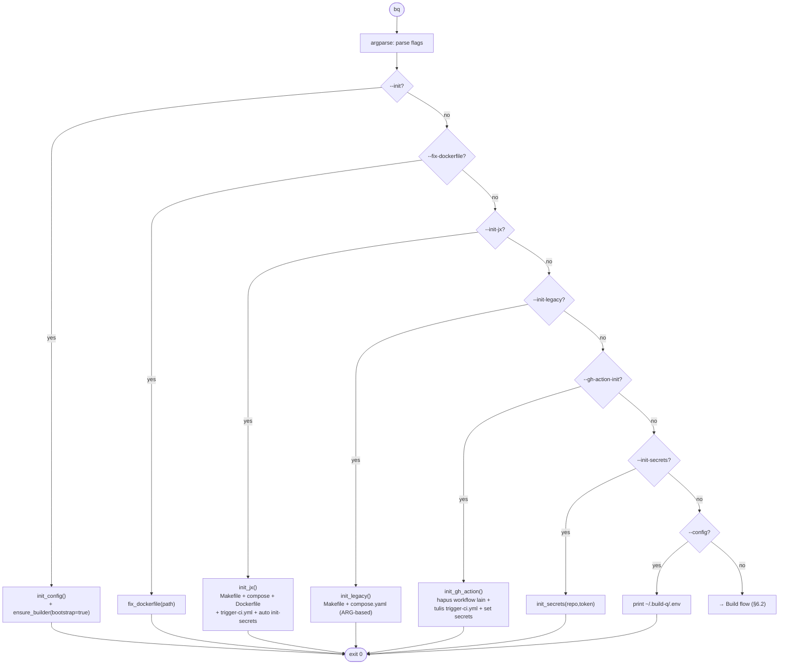
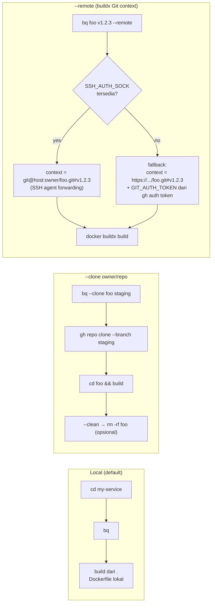
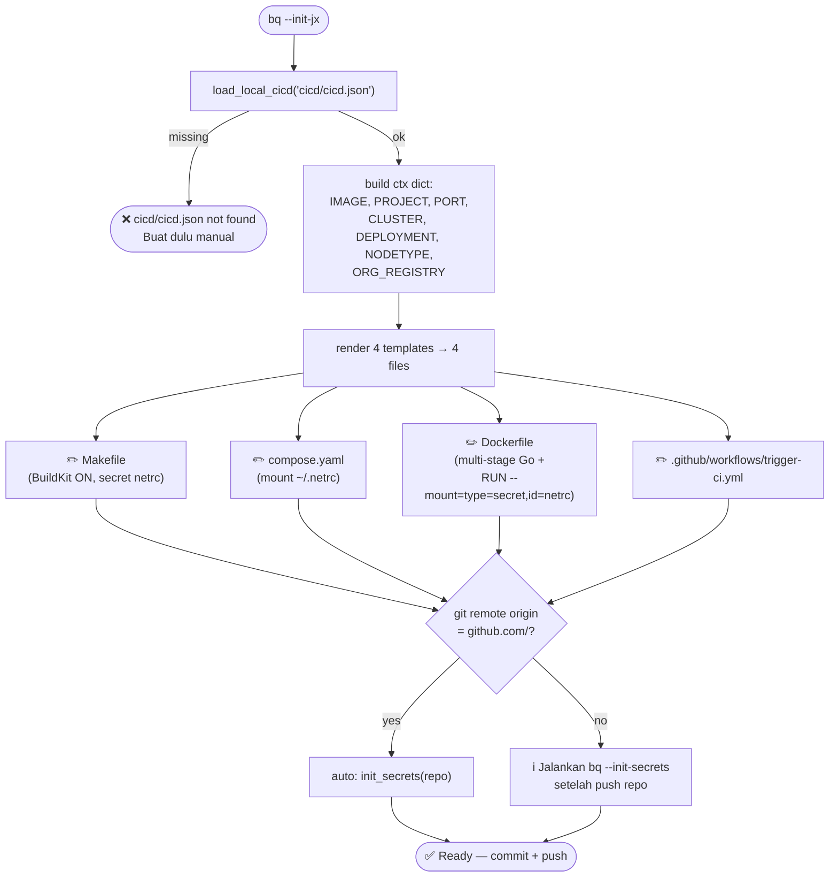
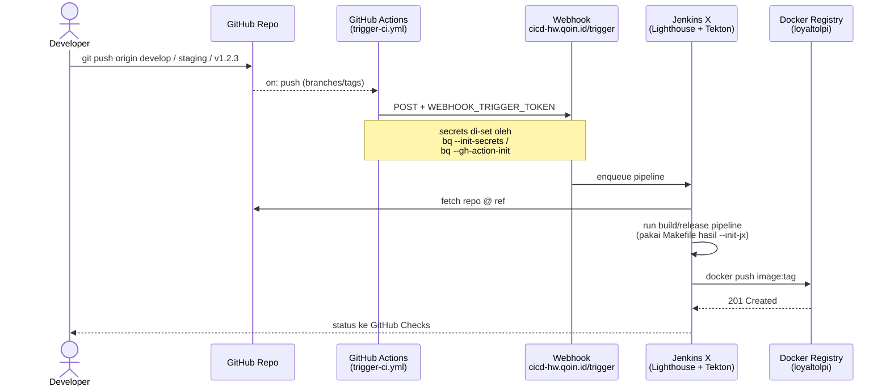
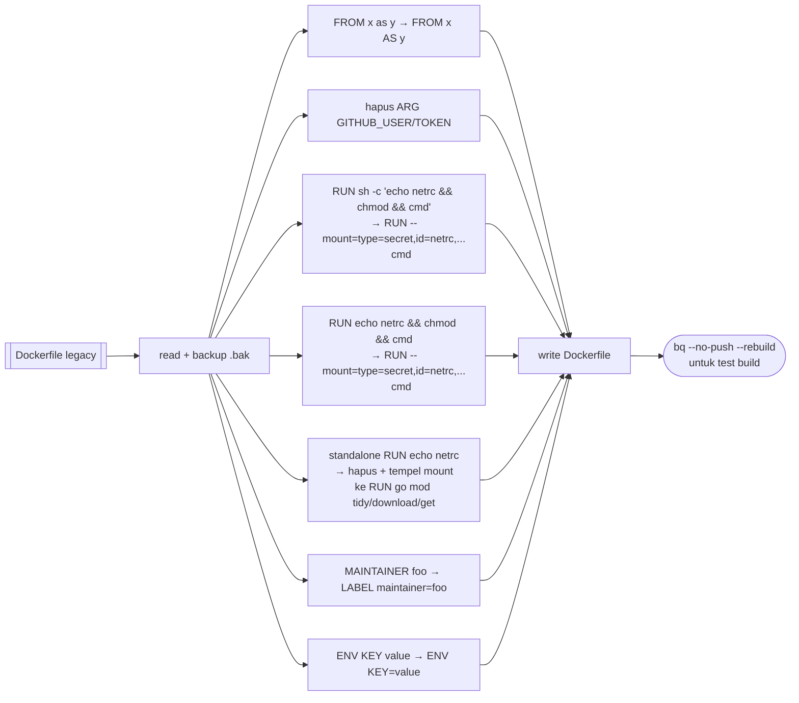
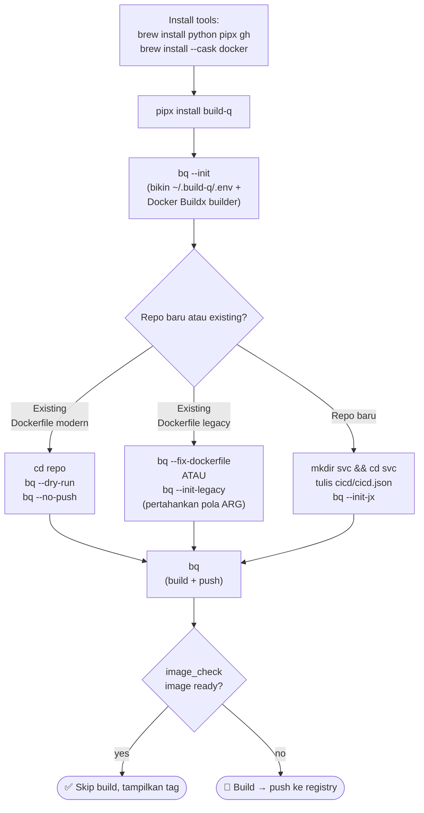
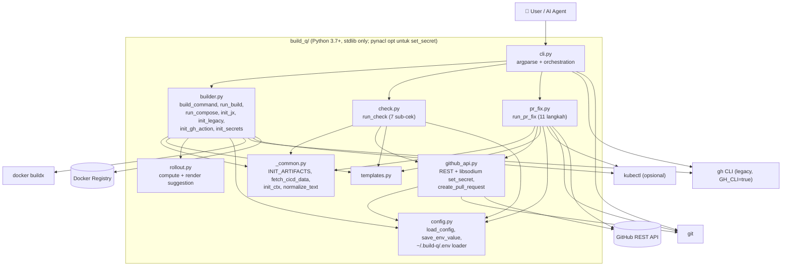
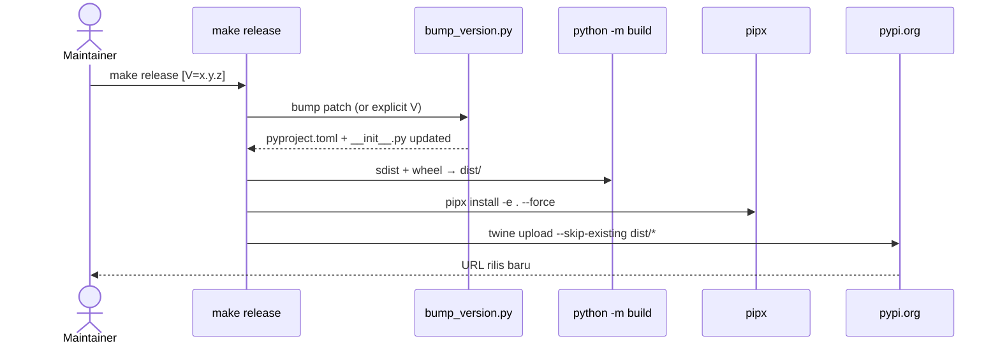

# PRD: build-q (bq) — Simplified Docker Buildx CLI

- **Version**: 0.1.27
- **Status**: Released (PyPI: [`build-q`](https://pypi.org/project/build-q/))
- **Owner**: ngen contributors
- **Entry points**: `build-q`, `bq`

---

## 1. Overview

`build-q` (dibaca *bq*, singkatan **Build-Quick**) adalah CLI Python zero-dependency yang menyederhanakan operasi `docker buildx build` di mesin lokal & remote. Tool ini menjembatani perintah Docker manual yang panjang dengan pipeline CI/CD produksi (Jenkins X): developer cukup menjalankan `bq` di dalam repo, dan seluruh flag (secret, build-arg, resource limit, tag image, registry) di-assemble otomatis dari Git + `cicd/cicd.json` + config global.

Selain build, `bq` menyediakan **scaffolding CI/CD** (`--init-jx`, `--init-legacy`), **bootstrap GitHub Actions trigger** (`--gh-action-init`), **setup webhook secrets** (`--init-secrets`), **migrasi Dockerfile legacy** (`--fix-dockerfile`), **auto-init Docker Buildx builder** (`--init`), mode **compose** (`--compose`) untuk build via `make build && make release`, **rollout suggestions** pasca-build (`set-image` / `gitops-set-image`), **verifikasi kesiapan repo tanpa clone** (`--check`), dan **one-shot fix** repo dgn template OUTDATED (`--pr-fix`: branch + push + PR + secrets).

Sejak **v0.1.17** semua operasi GitHub berjalan **native** (Python `urllib` + `git`) via `build_q/github_api.py` — tanpa dependensi `gh` CLI. Sejak **v0.1.22** default `GH_CLI=false` (jalur native aktif untuk install baru); pengguna lama tetap bekerja dengan setting existing.

## 2. Problem Statement

Developer sering perlu me-reproduksi build image Docker yang identik dengan CI/CD pipeline (secret `.netrc`, build-arg `BRANCH/PORT/PROJECT`, platform, memory/CPU limit, tag berbasis commit) di laptop untuk debugging atau hotfix. Menyusun `docker buildx build` panjang secara manual rawan salah ketik, tidak konsisten antar developer, dan tidak sinkron dengan pipeline resmi. Repo baru juga sering butuh boilerplate CI/CD (Makefile, compose, Dockerfile, GitHub Actions workflow) — copy-paste dari template lain rawan drift.

## 3. Goals

- **Simplicity**: satu perintah pendek (`bq`) menghasilkan build yang setara pipeline.
- **Convention over configuration**: repo, ref (branch/tag), image name, dan commit hash di-detect otomatis dari Git dan `cicd/cicd.json`.
- **Portability**: hanya butuh Python 3.7+ standard library (tanpa dependency eksternal).
- **CI/CD alignment**: memakai sumber kebenaran yang sama dengan pipeline, yaitu `cicd/cicd.json`.
- **Idempotency**: skip build bila image dengan tag yang sama sudah ada di registry (cek *paling awal*, sebelum bootstrap builder).
- **Beginner-friendly**: satu perintah untuk bootstrap CI/CD baru (`--init-jx`) atau memperbaiki repo legacy (`--fix-dockerfile` + `--init-legacy`).

## 4. Non-goals

- Bukan pengganti pipeline CI/CD (Jenkins X / GitHub Actions). Fokus di build lokal / ad-hoc.
- Tidak melakukan deploy ke Kubernetes/ArgoCD (di luar scope).
- Tidak mengelola login Docker/registry (asumsi user sudah `docker login`).
- ~~Tidak mengelola credential GitHub (delegasi ke `gh` CLI).~~ **Diperbarui v0.1.17+:** kini `bq` mengelola credential GitHub sendiri via `GITHUB_TOKEN` di `~/.build-q/.env` (jalur native), tidak butuh `gh` CLI. Toggle `GH_CLI=true` (legacy) masih tersedia untuk backward compat.

## 5. Personas

- **Backend engineer** yang ingin uji build image sebelum push ke pipeline.
- **DevOps** yang perlu rebuild patch tag `v*` untuk hotfix produksi tanpa memicu pipeline.
- **On-call engineer** yang perlu build image dari repo remote tanpa clone lokal (mode `--remote`).
- **Pemula / AI agent** yang perlu bootstrap CI/CD repo baru dari nol tanpa hafal template.

---

## 6. Workflow Diagrams

Bagian ini menggambarkan alur kerja `bq` secara visual — ditujukan agar AI agent dan pemula dapat memahami keputusan runtime tanpa membaca kode.

### 6.1 Command Router (flag → subcommand vs build)

Diagram ini memetakan flag apa yang akan menjalankan subcommand mana. Subcommand bersifat *mutually exclusive*: jika salah satu diberikan, alur build utama tidak dijalankan.



### 6.2 Build Flow (dengan early registry check)

Alur build utama. Perubahan **kritis versi 0.1.11**: pengecekan registry dilakukan **sebelum** `ensure_builder` dan validasi `cicd/cicd.json`. Efeknya, kalau image sudah ready, `bq` langsung skip tanpa bootstrap Docker Buildx builder atau butuh file `cicd/cicd.json`.

```mermaid
flowchart TD
    Start(["Build flow"]) --> Mode{"Mode?"}
    Mode -- "(default) local" --> Local["auto-detect repo + ref<br/>via git rev-parse"]
    Mode -- "--clone owner/repo" --> Clone["gh api commits/{ref}<br/>+ contents/cicd.json<br/>→ predict tag → early check<br/>(pre-clone skip if exists)"]
    Mode -- "--remote" --> Remote["gh api commits/{ref}<br/>+ contents/cicd.json<br/>→ compute tag,<br/>context = git_url#ref"]

    Local --> Predict["_predict_image_tag()<br/>registry/image:commit-7"]
    Clone --> RunBuild
    Remote --> Predict
    Predict --> Check{"image_check on?"}
    Check -- no (--rebuild) --> Ensure
    Check -- yes --> Probe["docker buildx imagetools inspect<br/>{predicted_tag}"]
    Probe -- exists --> Ready["✅ Image ready: {tag}<br/>⏭️ Skipping build"] --> End0(["exit 0"])
    Probe -- not found --> Ensure["ensure_builder(name)<br/>(auto-recover stale endpoint)"]

    Ensure --> LoadCicd["require cicd/cicd.json<br/>(hard error if missing)"]
    LoadCicd --> BuildCmd["build_command(...)<br/>merge: builder, memory, cpu,<br/>secret netrc, --build-arg BRANCH/PORT/PROJECT,<br/>tag, dockerfile, context"]
    BuildCmd --> Mode2{"--compose?"}
    Mode2 -- yes --> Compose["make build ENV=... +<br/>make release ENV=..."]
    Mode2 -- no --> Run["docker buildx build ..."]

    RunBuild["run_build(tag,...)"] --> Predict

    Compose --> Result{"rc==0?"}
    Run --> Result
    Result -- yes --> Ok(["✅ Build completed"])
    Result -- no --> Err(["❌ Build failed"])
```

### 6.3 Mode Sumber Kode (Local / Clone / Remote)



### 6.4 `--init-jx` Scaffolding (repo baru — pola modern secret mount)



### 6.5 Jenkins X Trigger Path (dari `git push` sampai pipeline jalan)



### 6.6 `--fix-dockerfile` Transformasi (legacy → modern)



### 6.7 Onboarding Journey (Pemula, 5 menit pertama)



---

## 7. Key Features

### 7.1 Git Auto-detection

Bila `<repo>` / `<ref>` tidak diberikan, CLI membaca dari Git lokal:

- `repo` ← nama dari `git remote get-url origin` (fallback: nama direktori).
- `ref` ← `git rev-parse --abbrev-ref HEAD` (fallback: tag `git describe --tags --exact-match`, lalu short SHA jika detached HEAD).

### 7.2 CI/CD Config Integration (`cicd/cicd.json`)

Membaca field:

- `IMAGE` → nama image.
- `PORT`, `PORT2`, `PROJECT` → dipetakan otomatis ke `--build-arg`.
- `CLUSTER`, `DEPLOYMENT`, `NODETYPE` → dipakai `--init-jx` sebagai konteks template.

### 7.3 Smart Ref → ENV Mapping

Helper terpusat `_env_from_ref(ref)` menyimpulkan environment dari nama branch/tag. Nilainya dipakai:

- Sebagai `--build-arg BRANCH=<env>` di `build_command` (buildx path — local, `--clone`, `--remote`).
- Sebagai `ENV=<env>` argument ke `make build && make release` di `run_compose` (mode `--compose`).

**INLINE dengan Tekton pipeline** di `~/jenkins-x/pipeline` (lighthouse
`triggers.yaml` + `webhook-server.py`). Aturan case shell yang di-mirror
exact di `_env_from_ref()`:

| Ref (branch/tag) | ENV | IMAGE_TAG |
| ------------------ | ----- | --------- |
| `v1.2.3`, `refs/tags/v*` | `production` | basename ref (`v1.2.3`) |
| `develop` | `develop` | short SHA |
| `staging` | `staging` | short SHA |
| `sandbox` | `sandbox` | short SHA |
| `main`, `master`, unknown, kosong | `staging` (Tekton fallback `*)`) | short SHA |

Catatan penting: push ke `main`/`master` **tidak** memicu production di JX;
tag `v*` yang memicu. Override manual: `--build-arg BRANCH=custom` menang.

### 7.4 Default Secret `netrc`

Selalu menambahkan `--secret id=netrc,src=$HOME/.netrc` (untuk dependency privat), kecuali user sudah menyertakan secret dengan id yang sama.

### 7.5 Registry Idempotency Check (Early Skip)

`docker buildx imagetools inspect {tag}` dijalankan **paling awal** di `run_build` (dan `run_compose`) — sebelum `ensure_builder` dan validasi `cicd.json`. Bila image ready → cetak `✅ Image ready: {tag}` dan `exit 0` tanpa side effect apa pun. Bypass via `--no-image-check` / `--rebuild`.

### 7.6 Mode Sumber Kode

- **Local (default)**: build dari direktori kerja saat ini.
- **`--clone <owner/repo>`**: clone via `gh` CLI ke direktori kerja, lalu build. `--clean` menghapus direktori clone setelah selesai. Pre-clone image check memakai commit SHA dari `gh api` — kalau image ready, tidak jadi clone.
- **`--remote`**: build langsung dari Git context (`git_url#ref`) — tidak clone lokal. `cicd.json` diambil via `gh api contents`. Commit hash via `gh api commits/{ref}`.
  - **SSH fallback**: bila `SSH_AUTH_SOCK` kosong, otomatis pindah ke HTTPS + `GIT_AUTH_TOKEN` secret (via `gh auth token`) supaya Buildx Git context tetap jalan tanpa `ssh-agent`.

### 7.7 Resource Limits

Default aman untuk laptop: `--memory 4g`, `--cpu-period 100000`, `--cpu-quota 200000` (dapat di-override via `~/.build-q/.env`).

### 7.8 Auto Tag

Bila `--tag` tidak diberikan: `{REGISTRY_URL}/{IMAGE}:{short_commit}` (7 karakter). Rumus identik antara `_predict_image_tag()` (untuk early check) dan `build_command()` (untuk eksekusi).

### 7.9 Dry Run

`--dry-run` mencetak command yang akan dijalankan tanpa eksekusi. Early image check di-skip pada dry-run supaya user selalu melihat command lengkapnya.

### 7.10 Konfigurasi Terpusat

File `~/.build-q/.env`:

| Variable | Default |
| ---------- | --------- |
| `BUILDER_NAME` | `mybuilder` |
| `REGISTRY_URL` | `registry.example.com` |
| `DEFAULT_MEMORY` | `4g` |
| `DEFAULT_CPU_PERIOD` | `100000` |
| `DEFAULT_CPU_QUOTA` | `200000` |
| `GIT_SSH_PREFIX` | `git@github.com:` |
| `GITHUB_ORG` | (kosong) |
| `WEBHOOK_TRIGGER_URL` | `https://cicd-hw.qoin.id/trigger` |
| `JX_KUBE_CONTEXT` | (kosong = current) |
| `JX_KUBE_NAMESPACE` | `jenkins-x` |
| `JX_TOKEN_SECRET` | `webhook-trigger-token` |

Perintah bantuan: `bq --init` (buat file + init Buildx builder), `bq --config` (tampilkan aktif).

### 7.11 Auto-init Docker Buildx Builder

`bq --init` (dan `run_build` sebagai safety net *setelah* early image check) memanggil `ensure_builder(name)` yang:

- `docker buildx inspect <name>` — cek eksistensi.
- Jika ada tetapi stdout memuat `Error:` (mis. endpoint Colima yang hilang) → `docker buildx rm -f` lalu re-create.
- Jika belum ada → `docker buildx create --name <name> --use [--bootstrap]`.

### 7.12 Scaffolding CI/CD Modern (`--init-jx`)

Generate 4 file dari `cicd/cicd.json`:

- `Makefile` — target `develop/staging/production/build/release/run`, BuildKit enabled.
- `compose.yaml` — service dengan `secrets: netrc` mount dari `$HOME/.netrc`.
- `Dockerfile` — multi-stage Go dengan `--mount=type=secret,id=netrc` (pola aman).
- `.github/workflows/trigger-ci.yml` — trigger webhook Jenkins X.

Placeholder `{{IMAGE}}/{{PROJECT}}/{{PORT}}/{{CLUSTER}}/{{DEPLOYMENT}}/{{NODETYPE}}/{{ORG_REGISTRY}}` disubstitusi dari `cicd.json` + config. Otomatis panggil `--init-secrets` bila `git remote origin` mengarah ke GitHub.

### 7.13 Scaffolding CI/CD Legacy (`--init-legacy`)

Untuk repo lama yang Dockerfile-nya masih pakai `ARG GITHUB_USER/GITHUB_TOKEN` (bukan BuildKit secret). Generate 2 file — **Dockerfile TIDAK ditimpa**:

- `Makefile` — auto-ambil `gh auth token` untuk `GITHUB_TOKEN` di local dev; support override `GIT_TOKEN` dari CI (mis. Tekton).
- `compose.yaml` — hybrid: mendukung Dockerfile legacy (build-arg) *dan* modern (secret mount).

### 7.14 Bootstrap Trigger CI Standar (`--gh-action-init`)

Menegakkan `trigger-ci.yml` sebagai **satu-satunya** workflow di `.github/workflows/`:

1. Hapus semua `*.yml`/`*.yaml` lain di `.github/workflows/` (workflow lama).
2. Tulis ulang `trigger-ci.yml` dari template.
3. Set `WEBHOOK_TRIGGER_URL` + `WEBHOOK_TRIGGER_TOKEN` via `gh secret set`.

Bisa dipakai berdiri sendiri di repo existing tanpa touch Makefile/Dockerfile.

### 7.15 GitHub Actions Webhook Secrets (`--init-secrets`)

Set dua secret di target repo:

- `WEBHOOK_TRIGGER_URL` — dari config `WEBHOOK_TRIGGER_URL`.
- `WEBHOOK_TRIGGER_TOKEN` — fetch otomatis via `kubectl get secret <JX_TOKEN_SECRET> -n <JX_KUBE_NAMESPACE>` lalu `base64 -d`.

Auto-detect target repo dari `git remote get-url origin` (parse `owner/repo`). Override manual via positional `bq --init-secrets <owner>/<repo>` atau `--token <VALUE>` untuk skip kubectl.

### 7.16 Migrasi Dockerfile Legacy (`--fix-dockerfile`)

Transformasi Dockerfile lama menjadi modern. Selain migrasi netrc, mencakup pembersihan directive deprecated:

- Normalisasi `FROM ... as ...` → `FROM ... AS ...`.
- Hapus `ARG GITHUB_USER` / `ARG GITHUB_TOKEN`.
- Rewrite `RUN sh -c '...'` dan `RUN echo ...` yang mem-build netrc dari ARG → `RUN --mount=type=secret,id=netrc,target=/root/.netrc \ ...`.
- **Standalone** `RUN echo "machine github.com ..." > ~/.netrc` (tanpa `&& chmod && cmd`) → dihapus, secret mount otomatis ditempel ke RUN yang berisi `go mod tidy/download` atau `go get`.
- `MAINTAINER foo` (deprecated) → `LABEL maintainer="foo"`.
- Legacy `ENV KEY value` (tanpa `=`) → `ENV KEY=value`.
- Backup ke `<path>.bak`.

### 7.17 GitHub Auth Injection (`--gh-auth`)

Untuk Dockerfile legacy yang belum dimigrasi: inject `--build-arg GITHUB_USER=$(gh api user --jq .login)` dan `--build-arg GITHUB_TOKEN=$(gh auth token)`. Token di-mask di log output (`GITHUB_TOKEN=***`); nilai asli diteruskan ke `docker buildx`.

### 7.18 GitHub Org Shorthand

Bila `GITHUB_ORG` di-set, positional `repo` yang tidak mengandung `/` atau scheme akan di-expand: `bq foo staging --remote` → `bq Qoin-Digital-Indonesia/foo staging --remote`.

### 7.19 Compose Mode (`--compose`)

Alternatif eksekusi build: jalankan `make build ENV=<env> && make release ENV=<env>` (bukan `docker buildx`). Cocok untuk repo yang alur build-nya sudah pakai Makefile + docker compose (mis. hasil `--init-jx` / `--init-legacy`).

- `ENV=<env>` disimpulkan lewat `_env_from_ref(ref)` — lihat §7.3 (mendukung `develop`/`staging`/`production` sesuai nama branch/tag).
- Tag prediction memakai `get_local_tag_or_commit()` yang paritas dengan Makefile (`git describe --tags --exact-match || git rev-parse --short HEAD`), sehingga early registry check mencocokkan tag yang akan di-push `make release`. Sejak v0.1.19 `bq` default (buildx) juga INLINE dengan aturan tag-first ini.
- Bisa digabung dengan `--clone`: `bq --clone owner/repo staging --compose` → clone → cd → `make build/release ENV=staging`.

### 7.20 Native GitHub REST + Git (`GH_CLI=false`, default sejak v0.1.22)

Menggantikan pemakaian `gh` CLI dengan `urllib` + `git` biasa. Cred disimpan di `~/.build-q/.env` (`GITHUB_TOKEN`, `GITHUB_USER`).

- `build_q/github_api.py` — stdlib wrapper: `get_contents_raw`, `get_commit_sha`, `get_user_login`, `get_auth_token`, `clone`, `set_secret` (butuh `pynacl`), `create_pull_request`, `list_open_prs`.
- Toggle `GH_CLI=true` masih tersedia untuk fallback ke `gh` CLI (deprecated, rencana hapus v0.2.0).
- Scope PAT minimum: `repo` + `workflow` + `read:user` (workflow wajib untuk `--pr-fix` yang menyentuh `.github/workflows/*`).

### 7.21 Rollout Suggestions Pasca-Build

Setelah build sukses (atau `--dry-run`), `bq` cetak 2 perintah siap copy-paste yang membungkus tools eksternal `set-image` (imperative `kubectl set image` + `rollout status --watch`) dan `gitops-set-image` (declarative patch YAML di repo GitOps + push).

- Path template GitOps: `{infra}/{ns}/{deployment}_deployment.yaml`. `infra=cce` (Huawei) default, `k8s` untuk SLS. Override: `--infra {cce,k8s}` atau `--gitops-path`.
- Namespace fallback: `--ns` > `<env>-<cicd.PROJECT>` > `<env>-<NS_SUFFIX>`. Sejak v0.1.22 `cicd.PROJECT` menang atas `NS_SUFFIX` global.
- Prefix image: `DOCKERHUB_ORG` bila di-set, else `REGISTRY_URL`.
- Suggestion hanya PRINT — tidak eksekusi.

### 7.22 Verifikasi Kesiapan Repo (`--check`)

`bq --check <repo> <ref> --remote` — cek tanpa clone: repo/ref accessible, cicd config valid, artifact `init-jx` exist **dan match template terkini** (byte compare setelah normalize), image di registry (tag-aware sejak v0.1.23), dan file deployment GitOps.

- Exit 0 bila wajib lulus (repo/ref + cicd), 1 bila miss.
- Warning `outdated:*` → suggestion `bq --pr-fix <repo> <ref>` otomatis dicetak.

### 7.23 One-Shot Fix (`--pr-fix`)

`bq --pr-fix <repo> <ref>` — 11 langkah otomatis: preflight → clone shallow → branch `fix/jx-init-<ts>` → regenerate 4 artifact via template + cicd ctx → commit → push → set 2 repo secrets (`WEBHOOK_TRIGGER_URL/TOKEN`) via libsodium → open PR ke `ref` → cleanup.

- Preflight: `GITHUB_TOKEN` (scope `workflow`), `WEBHOOK_TRIGGER_TOKEN` (auto-fetch dari k8s bila kosong, disimpan ke `.env`), `pynacl`.
- Flag: `--pr-branch NAME`, `--keep-workdir`, `--dry-run` (skip push/secrets/PR).
- Deduplikasi: bila PR untuk branch fix sudah open, print URL eksisting.
- Default `JX_KUBE_CONTEXT=hw-dev` (sejak v0.1.25).

---

## 8. CLI Contract

```
bq [<repo> [<ref>]] [OPTIONS]
```

Flag penting: `--local`, `--remote`, `--clone <owner/repo>`, `--clean`, `--compose`, `--cicd <path>`, `--context <dir>`, `-f/--dockerfile`, `-t/--tag`, `--push/--no-push`, `--image-check/--no-image-check/--rebuild`, `--platform`, `--build-arg`, `--secret`, `--gh-auth`, `--dry-run`, `--init`, `--force`, `--config`, `--init-jx`, `--init-legacy`, `--gh-action-init`, `--init-secrets`, `--fix-dockerfile [PATH]`, `--token`, `--version`. **Sejak v0.1.18+:** `--ns <name>`, `--infra {cce,k8s}`, `--gitops-path <path>` (rollout overrides). **Sejak v0.1.22+:** `--check`. **Sejak v0.1.24+:** `--pr-fix`, `--pr-branch <name>`, `--keep-workdir`.

Default: `--push=True`, `--image-check=True`, `--platform=linux/amd64`, secret `netrc` otomatis.

## 9. Arsitektur



Distribusi via `pyproject.toml` (setuptools) → dua entry point script: `build-q` & `bq`.

## 10. Technical Requirements

- Python 3.7+ (standard library only).
- Docker Engine + Buildx plugin.
- Git (opsional; wajib untuk auto-detect & mode local).
- GitHub credential: `GITHUB_TOKEN` di `~/.build-q/.env` (scope: `repo`, `workflow`, `read:user`). GitHub CLI `gh` opsional (mode legacy `GH_CLI=true`; default sejak v0.1.22: `GH_CLI=false` = native REST).
- `kubectl` (opsional; untuk fetch webhook token otomatis pada `--pr-fix` preflight; default context `hw-dev`).
- `pynacl` (opsional; wajib untuk `--pr-fix` dan `--init-secrets` di mode native — enkripsi libsodium repo secret).

## 11. Release Process

`Makefile` menyediakan `make build` dan `make release [V=x.y.z]`:

1. `scripts/bump_version.py` bump patch version di `pyproject.toml` + `build_q/__init__.py`.
2. Build sdist + wheel via `python3 -m build` (fallback: `pipx run --spec build pyproject-build`).
3. Install lokal editable via `pipx install -e . --force`.
4. Upload ke PyPI via `pipx run twine upload --skip-existing dist/*` — kredensial dari `~/.pypirc`.



## 12. Success Metrics

- **Adoption**: jumlah repo di organisasi yang punya `cicd/cicd.json` kompatibel dan memakai `bq` untuk build lokal.
- **Konsistensi**: image hasil `bq` bit-identical dengan hasil pipeline untuk commit yang sama.
- **Time-to-image**: waktu build ulang berkurang (dengan early `--image-check` skip build redundan tanpa bootstrap builder).
- **Bootstrap time**: repo baru dari nol → CI/CD siap dalam < 2 menit (`bq --init-jx` + `git push`).

## 13. Changelog Ringkas

- **0.1.27** — DRY refactor Fase 1: modul baru `_common.py` (`INIT_ARTIFACTS`, `fetch_cicd_data`, `init_ctx_from_cicd`, `normalize_text`); `github_api.normalize_repo` public; hapus 4× normalisasi repo inline + 2× cicd fetch loop di check/pr_fix + duplikat helper `_normalize`/`_init_ctx`. Zero-behavior-change (~165 LOC reduksi). PRD di-sync ke v0.1.27.
- **0.1.26** — UX fix: `--pr-fix` push gagal karena token kurang scope `workflow` → pesan 4-langkah perbaikan konkret + update template `.env`.
- **0.1.25** — Default `JX_KUBE_CONTEXT=hw-dev` (cluster JX Qoin) + error preflight informatif.
- **0.1.24** — `bq --pr-fix <repo> <ref>`: 11-langkah one-shot fix (branch + regenerate 4 artifact + push + set 2 repo secrets + open PR); modul baru `pr_fix.py`; `github_api.create_pull_request` + `list_open_prs`; `config.save_env_value`.
- **0.1.23** — `--check` tag-aware (`:v2.2.1` bukan `:280022c`) + init artifact MATCH template terkini (deteksi OUTDATED via render + normalize compare). Bonus: `_BUNDLED_DOCKERFILE` → raw string (fix SyntaxWarning + `\n` literal untuk `printf`).
- **0.1.22** — Fitur `bq --check`, default `GH_CLI=false`, ns fallback prefer `cicd.PROJECT` atas `NS_SUFFIX` global.
- **0.1.21** — Fix: `bq` default (buildx) auto-inject `GITHUB_USER/GITHUB_TOKEN` build-arg (INLINE dgn compose.yaml).
- **0.1.20** — Fix: pre-clone/pre-remote tag prediction hormati git tag ref (v1.0.1 → `:v1.0.1`, bukan `:64a92b4`).
- **0.1.19** — Fix: `bq` default (buildx) sinkron dgn `--compose` — kedua mode pakai `get_local_tag_or_commit()` (tag-first).
- **0.1.18** — Rollout suggestion pasca-build: `set-image` (imperative) + `gitops-set-image` (declarative GitOps). Flag `--ns`, `--infra`, `--gitops-path`. Config baru: `DOCKERHUB_*`, `GITOPS_*`, `NS_SUFFIX`. Modul `rollout.py`.
- **0.1.17** — Toggle `GH_CLI` + jalur native REST + git (`build_q/github_api.py`, stdlib `urllib`); `--init-secrets` native via `pynacl` + libsodium; cred `GITHUB_USER/TOKEN` di `~/.build-q/.env`. Fallback `cicd/cicd.json` → `cicd.json` root.
- **0.1.11** — bug fix: early image check di `run_build`/`run_compose` (dipanggil sebelum `ensure_builder` & sebelum wajib `cicd.json`). Repo tanpa `cicd/cicd.json` sekarang bisa memanfaatkan skip idempotency.
- **0.1.10** — `--init-jx`, `--init-secrets`, `--fix-dockerfile`, `--gh-auth`, `--init-legacy`, `--gh-action-init`, `--compose`, remote SSH → HTTPS fallback, ekspansi `--fix-dockerfile` (standalone netrc + `MAINTAINER` + legacy `ENV`).

## 14. Future Roadmap

- Multi-registry profile (per-project).
- Integrasi konteks Kubernetes (langsung deploy hasil build ke cluster lokal / kind).
- Caching layer buildx yang lebih pintar (mount cache antar build).
- Support platform `linux/arm64` cross-build default untuk M-series Mac.
- Plugin hook pre/post build untuk custom step.
- Migrasi `pyproject.toml` `project.license` ke SPDX string (deadline setuptools 2027-Feb-18).
