# PRD: build-q (bq) — Simplified Docker Buildx CLI

- **Version**: 0.1.27
- **Status**: Released (PyPI: [`build-q`](https://pypi.org/project/build-q/))
- **Owner**: ngen contributors
- **Entry points**: `build-q`, `bq`

---

## 1. Overview

`build-q` (dibaca *bq*, singkatan **Build-Quick**) adalah CLI Python zero-dependency yang menyederhanakan operasi `docker buildx build` di mesin lokal & remote. Tool ini menjembatani perintah Docker manual yang panjang dengan pipeline CI/CD produksi (Jenkins X): developer cukup menjalankan `bq` di dalam repo, dan seluruh flag (secret, build-arg, resource limit, tag image, registry) di-assemble otomatis dari Git + `cicd/cicd.json` + config global.

Selain build, `bq` menyediakan:

| Kategori | Fitur |
|----------|-------|
| **Scaffolding** | `--init-jx` (modern), `--init-legacy` (legacy ARG-based) |
| **CI/CD Trigger** | `--gh-action-init`, `--init-secrets`, `--cicd-trigger` (webhook manual), `--cicd-webhook` (verifikasi webhook) |
| **Build Ops** | `--fix-dockerfile` (migrasi), `--init` (builder), `--compose` (make build) |
| **GitOps** | `--bootstrap-k8s` (manifest K8s → PR), `--gitops-set-image` (patch YAML), `--set-image` (kubectl), `--is-match-image` (drift check) |
| **Verifikasi** | `--check` (repo readiness), `--repo-check` (PocketBase lookup), `--doctor` (tools & creds) |
| **Fix** | `--pr-fix` (one-shot fix + PR) |
| **Interaktif** | `--tui` (Jev Agent Planner TUI) |
| **Credentials** | `--pb-login`, `--pb-status`, `--pb-pull`, `--pb-logout` (PocketBase IDP) |

Sejak **v0.1.17** semua operasi GitHub berjalan **native** (Python `urllib` + `git`) via `build_q/github_api.py` — tanpa dependensi `gh` CLI. Sejak **v0.1.22** default `GH_CLI=false` (jalur native aktif untuk install baru); pengguna lama tetap bekerja dengan setting existing. Sejak **v0.1.30** CICD config mendukung **PocketBase fallback** — repo tanpa `cicd/cicd.json` bisa dijembatani via centralized IDP (`cicd-hw.qoin.id/devops`).

## 2. Problem Statement

Developer sering perlu me-reproduksi build image Docker yang identik dengan CI/CD pipeline (secret `.netrc`, build-arg `BRANCH/PORT/PROJECT`, platform, memory/CPU limit, tag berbasis commit) di laptop untuk debugging atau hotfix. Menyusun `docker buildx build` panjang secara manual rawan salah ketik, tidak konsisten antar developer, dan tidak sinkron dengan pipeline resmi. Repo baru juga sering butuh boilerplate CI/CD (Makefile, compose, Dockerfile, GitHub Actions workflow) — copy-paste dari template lain rawan drift.

## 3. Goals

- **Simplicity**: satu perintah pendek (`bq`) menghasilkan build yang setara pipeline.
- **Convention over configuration**: repo, ref (branch/tag), image name, dan commit hash di-detect otomatis dari Git dan `cicd/cicd.json`.
- **Portability**: hanya butuh Python 3.7+ standard library (tanpa dependency eksternal).
- **CI/CD alignment**: memakai sumber kebenaran yang sama dengan pipeline, yaitu `cicd/cicd.json`.
- **Idempotency**: skip build bila image dengan tag yang sama sudah ada di registry (cek *paling awal*, sebelum bootstrap builder).
- **Beginner-friendly**: satu perintah untuk bootstrap CI/CD baru (`--init-jx`) atau memperbaiki repo legacy (`--fix-dockerfile` + `--init-legacy`).

## 4. Non-goals

- Bukan pengganti pipeline CI/CD (Jenkins X / GitHub Actions). Fokus di build lokal / ad-hoc.
- ~~Tidak melakukan deploy ke Kubernetes/ArgoCD (di luar scope).~~ **Diperbarui v0.1.29+:** `--bootstrap-k8s` men-generate manifest K8s dan mengirim sebagai PR ke GitOps repo. Deploy tetap dilakukan oleh ArgoCD/Kustomize dari PR yang di-merge — `bq` tidak apply langsung ke cluster (kecuali opt-in `--apply-secret` untuk non-production).
- Tidak mengelola login Docker/registry (asumsi user sudah `docker login`).
- ~~Tidak mengelola credential GitHub (delegasi ke `gh` CLI).~~ **Diperbarui v0.1.17+:** kini `bq` mengelola credential GitHub sendiri via `GITHUB_TOKEN` di `~/.build-q/.env` (jalur native), tidak butuh `gh` CLI. Toggle `GH_CLI=true` (legacy) masih tersedia untuk backward compat.
- ~~Tidak mengelola credential terpusat.~~ **Diperbarui v0.1.27+:** PocketBase IDP (`pb_api.py`) memungkinkan zero-local-config workflow — engineer hanya perlu `PB_API_URL/USER/PASS`; seluruh secret di-hydrate dari PB API.

## 5. Personas

- **Backend engineer** yang ingin uji build image sebelum push ke pipeline.
- **DevOps** yang perlu rebuild patch tag `v*` untuk hotfix produksi tanpa memicu pipeline.
- **On-call engineer** yang perlu build image dari repo remote tanpa clone lokal (mode `--remote`).
- **Pemula / AI agent** yang perlu bootstrap CI/CD repo baru dari nol tanpa hafal template.

---

## 6. Workflow Diagrams

Bagian ini menggambarkan alur kerja `bq` secara visual — ditujukan agar AI agent dan pemula dapat memahami keputusan runtime tanpa membaca kode.

### 6.1 Command Router (flag → subcommand vs build)

Diagram ini memetakan flag apa yang akan menjalankan subcommand mana. Subcommand bersifat *mutually exclusive*: jika salah satu diberikan, alur build utama tidak dijalankan. Evaluasi terjadi **top-down** — flag pertama yang match di-dispatch.

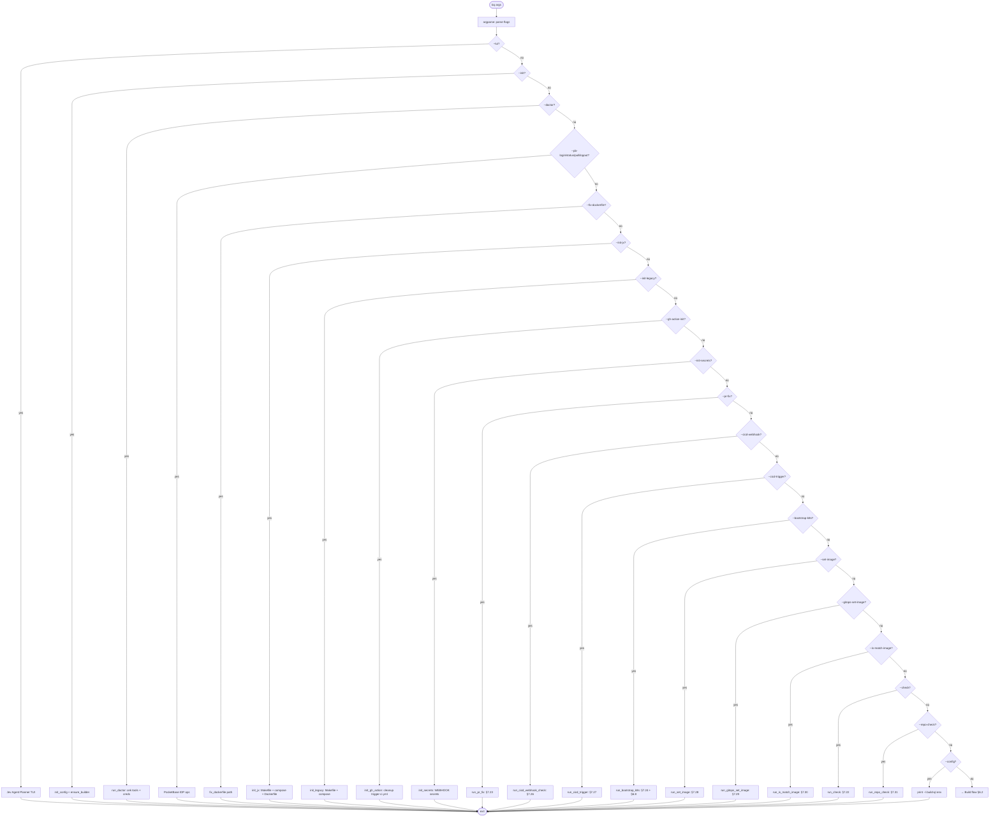
```mermaid
flowchart TD
    Start(["bq args"]) --> Parse["argparse: parse flags"]
    Parse --> Tui{"--tui?"}
    Tui -- yes --> TuiR["Jev Agent Planner TUI"] --> End(["exit"])
    Tui -- no --> Init{"--init?"}
    Init -- yes --> InitCfg["init_config + ensure_builder"] --> End
    Init -- no --> Doctor{"--doctor?"}
    Doctor -- yes --> DocR["run_doctor: cek tools + creds"] --> End
    Doctor -- no --> PB{"--pb-login/status/pull/logout?"}
    PB -- yes --> PBR["PocketBase IDP ops"] --> End
    PB -- no --> Fix{"--fix-dockerfile?"}
    Fix -- yes --> FixDf["fix_dockerfile path"] --> End
    Fix -- no --> InitJx{"--init-jx?"}
    InitJx -- yes --> ScaffoldJx["init_jx: Makefile + compose + Dockerfile"] --> End
    InitJx -- no --> InitLegacy{"--init-legacy?"}
    InitLegacy -- yes --> ScaffoldLegacy["init_legacy: Makefile + compose"] --> End
    InitLegacy -- no --> GhAct{"--gh-action-init?"}
    GhAct -- yes --> InitAct["init_gh_action: cleanup trigger-ci.yml"] --> End
    GhAct -- no --> InitSec{"--init-secrets?"}
    InitSec -- yes --> SetSec["init_secrets: WEBHOOK secrets"] --> End
    InitSec -- no --> PRFix{"--pr-fix?"}
    PRFix -- yes --> PRFixR["run_pr_fix: §7.23"] --> End
    PRFix -- no --> CicdWH{"--cicd-webhook?"}
    CicdWH -- yes --> CicdWHR["run_cicd_webhook_check: §7.26"] --> End
    CicdWH -- no --> CicdTr{"--cicd-trigger?"}
    CicdTr -- yes --> CicdTrR["run_cicd_trigger: §7.27"] --> End
    CicdTr -- no --> BootK8s{"--bootstrap-k8s?"}
    BootK8s -- yes --> BootR["run_bootstrap_k8s: §7.24 + §6.8"] --> End
    BootK8s -- no --> SetImg{"--set-image?"}
    SetImg -- yes --> SetImgR["run_set_image: §7.28"] --> End
    SetImg -- no --> GitopsImg{"--gitops-set-image?"}
    GitopsImg -- yes --> GitopsR["run_gitops_set_image: §7.29"] --> End
    GitopsImg -- no --> MatchImg{"--is-match-image?"}
    MatchImg -- yes --> MatchR["run_is_match_image: §7.30"] --> End
    MatchImg -- no --> Chk{"--check?"}
    Chk -- yes --> ChkR["run_check: §7.22"] --> End
    Chk -- no --> RepoChk{"--repo-check?"}
    RepoChk -- yes --> RepoChkR["run_repo_check: §7.31"] --> End
    RepoChk -- no --> Cfg{"--config?"}
    Cfg -- yes --> ShowCfg["print ~/.build-q/.env"] --> End
    Cfg -- no --> Build["→ Build flow §6.2"]
```

### 6.2 Build Flow (dengan early registry check)

Alur build utama. Perubahan **kritis versi 0.1.11**: pengecekan registry dilakukan **sebelum** `ensure_builder` dan validasi `cicd/cicd.json`. Efeknya, kalau image sudah ready, `bq` langsung skip tanpa bootstrap Docker Buildx builder atau butuh file `cicd/cicd.json`.

```mermaid
flowchart TD
    Start(["Build flow"]) --> Mode{"Mode?"}
    Mode -- "(default) local" --> Local["auto-detect repo + ref<br/>via git rev-parse"]
    Mode -- "--clone owner/repo" --> Clone["gh api commits/{ref}<br/>+ contents/cicd.json<br/>→ predict tag → early check<br/>(pre-clone skip if exists)"]
    Mode -- "--remote" --> Remote["gh api commits/{ref}<br/>+ contents/cicd.json<br/>→ compute tag,<br/>context = git_url#ref"]

    Local --> Predict["_predict_image_tag()<br/>registry/image:commit-7"]
    Clone --> RunBuild
    Remote --> Predict
    Predict --> Check{"image_check on?"}
    Check -- no (--rebuild) --> Ensure
    Check -- yes --> Probe["docker buildx imagetools inspect<br/>{predicted_tag}"]
    Probe -- exists --> Ready["✅ Image ready: {tag}<br/>⏭️ Skipping build"] --> End0(["exit 0"])
    Probe -- not found --> Ensure["ensure_builder(name)<br/>(auto-recover stale endpoint)"]

    Ensure --> LoadCicd["require cicd/cicd.json<br/>(hard error if missing)"]
    LoadCicd --> BuildCmd["build_command(...)<br/>merge: builder, memory, cpu,<br/>secret netrc, --build-arg BRANCH/PORT/PROJECT,<br/>tag, dockerfile, context"]
    BuildCmd --> Mode2{"--compose?"}
    Mode2 -- yes --> Compose["make build ENV=... +<br/>make release ENV=..."]
    Mode2 -- no --> Run["docker buildx build ..."]

    RunBuild["run_build(tag,...)"] --> Predict

    Compose --> Result{"rc==0?"}
    Run --> Result
    Result -- yes --> Ok(["✅ Build completed"])
    Result -- no --> Err(["❌ Build failed"])
```

### 6.3 Mode Sumber Kode (Local / Clone / Remote)

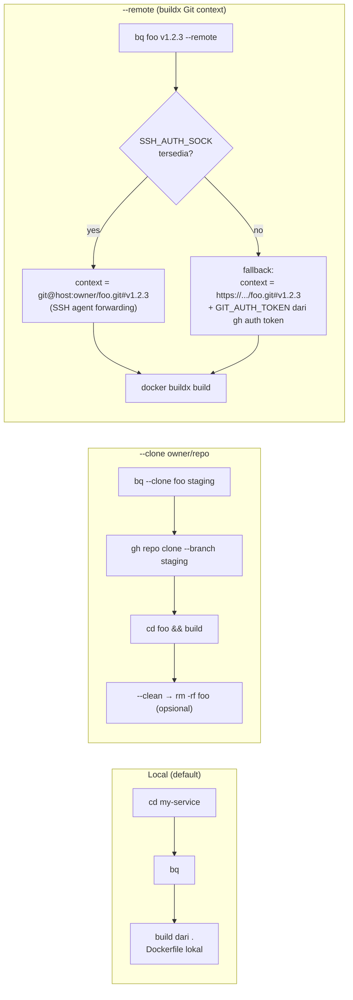
```mermaid
flowchart LR
    subgraph Local["Local (default)"]
      L1["cd my-service"] --> L2["bq"] --> L3["build dari .<br/>Dockerfile lokal"]
    end
    subgraph Cloned["--clone owner/repo"]
      C1["bq --clone foo staging"] --> C2["gh repo clone --branch staging"]
      C2 --> C3["cd foo && build"]
      C3 --> C4["--clean → rm -rf foo (opsional)"]
    end
    subgraph Remote["--remote (buildx Git context)"]
      R1["bq foo v1.2.3 --remote"] --> R2{"SSH_AUTH_SOCK<br/>tersedia?"}
      R2 -- yes --> R3["context = git@host:owner/foo.git#v1.2.3<br/>(SSH agent forwarding)"]
      R2 -- no --> R4["fallback:<br/>context = https://.../foo.git#v1.2.3<br/>+ GIT_AUTH_TOKEN dari gh auth token"]
      R3 --> R5["docker buildx build <context>"]
      R4 --> R5
    end
```

### 6.4 `--init-jx` Scaffolding (repo baru — pola modern secret mount)

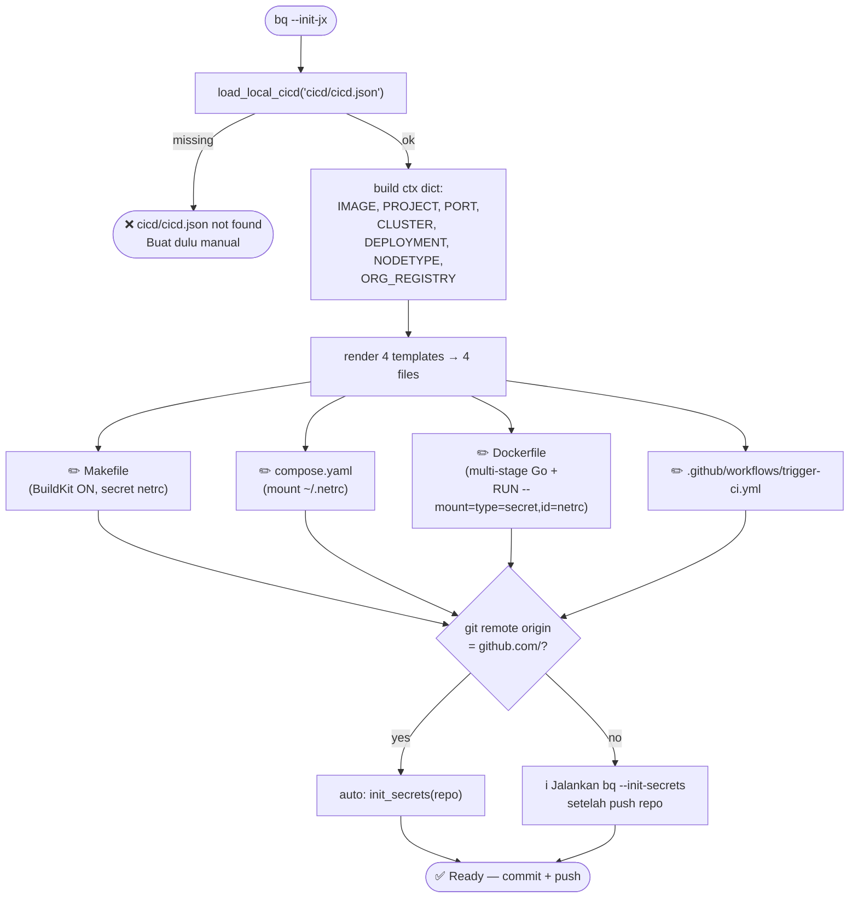
```mermaid
flowchart TD
    Start(["bq --init-jx"]) --> Load["load_local_cicd('cicd/cicd.json')"]
    Load -- missing --> Err(["❌ cicd/cicd.json not found<br/>Buat dulu manual"])
    Load -- ok --> Ctx["build ctx dict:<br/>IMAGE, PROJECT, PORT,<br/>CLUSTER, DEPLOYMENT, NODETYPE,<br/>ORG_REGISTRY"]
    Ctx --> Render["render 4 templates → 4 files"]
    Render --> F1["✏️ Makefile<br/>(BuildKit ON, secret netrc)"]
    Render --> F2["✏️ compose.yaml<br/>(mount ~/.netrc)"]
    Render --> F3["✏️ Dockerfile<br/>(multi-stage Go +<br/>RUN --mount=type=secret,id=netrc)"]
    Render --> F4["✏️ .github/workflows/trigger-ci.yml"]
    F1 & F2 & F3 & F4 --> Detect{"git remote origin<br/>= github.com/?"}
    Detect -- yes --> Sec["auto: init_secrets(repo)"]
    Detect -- no --> Manual["ℹ️ Jalankan bq --init-secrets<br/>setelah push repo"]
    Sec --> Done(["✅ Ready — commit + push"])
    Manual --> Done
```

### 6.5 Jenkins X Trigger Path (dari `git push` sampai pipeline jalan)

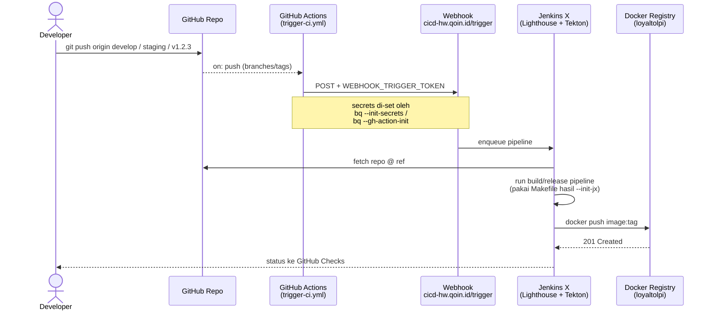
```mermaid
sequenceDiagram
    actor Dev as Developer
    participant Git as GitHub Repo
    participant GA as GitHub Actions<br/>(trigger-ci.yml)
    participant WH as Webhook<br/>cicd-hw.qoin.id/trigger
    participant JX as Jenkins X<br/>(Lighthouse + Tekton)
    participant Reg as Docker Registry<br/>(loyaltolpi)

    Dev->>Git: git push origin develop / staging / v1.2.3
    Git-->>GA: on: push (branches/tags)
    GA->>WH: POST + WEBHOOK_TRIGGER_TOKEN
    Note over GA,WH: secrets di-set oleh<br/>bq --init-secrets /<br/>bq --gh-action-init
    WH->>JX: enqueue pipeline
    JX->>Git: fetch repo @ ref
    JX->>JX: run build/release pipeline<br/>(pakai Makefile hasil --init-jx)
    JX->>Reg: docker push image:tag
    Reg-->>JX: 201 Created
    JX-->>Dev: status ke GitHub Checks
```

### 6.6 `--fix-dockerfile` Transformasi (legacy → modern)

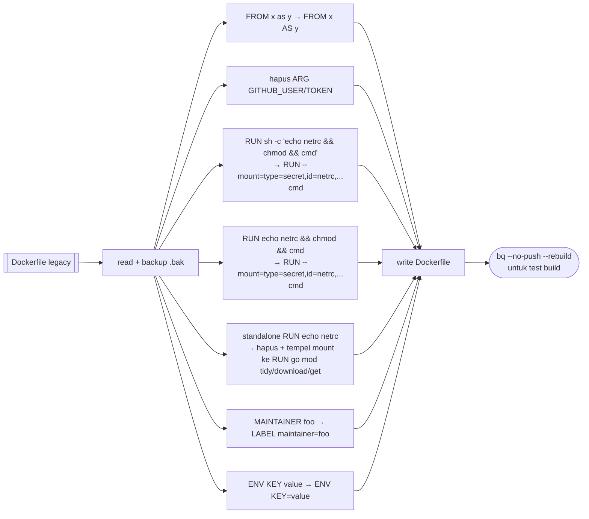
```mermaid
flowchart LR
    Old[["Dockerfile legacy"]] --> Read["read + backup .bak"]
    Read --> T1["FROM x as y → FROM x AS y"]
    Read --> T2["hapus ARG GITHUB_USER/TOKEN"]
    Read --> T3["RUN sh -c 'echo netrc && chmod && cmd'<br/>→ RUN --mount=type=secret,id=netrc,...<br/>&nbsp;&nbsp;&nbsp;&nbsp;&nbsp;cmd"]
    Read --> T4["RUN echo netrc && chmod && cmd<br/>→ RUN --mount=type=secret,id=netrc,...<br/>&nbsp;&nbsp;&nbsp;&nbsp;&nbsp;cmd"]
    Read --> T5["standalone RUN echo netrc<br/>→ hapus + tempel mount<br/>ke RUN go mod tidy/download/get"]
    Read --> T6["MAINTAINER foo → LABEL maintainer=foo"]
    Read --> T7["ENV KEY value → ENV KEY=value"]
    T1 & T2 & T3 & T4 & T5 & T6 & T7 --> Write["write Dockerfile"]
    Write --> Next(["bq --no-push --rebuild<br/>untuk test build"])
```

### 6.8 `--bootstrap-k8s` Flow (bootstrap manifest K8s ke GitOps)


```mermaid
flowchart TD
    A["bq --bootstrap-k8s repo ref<br/>--gitops-repo r --gitops-branch b<br/>--path-yaml p"] --> B{"Preflight<br/>GH_CLI=false<br/>GITHUB_TOKEN"}
    B -- OK --> C["Derive env dari ref<br/>+ namespace dari path-yaml<br/>atau --namespace override"]
    B -- missing --> Z1(["Abort"])
    C --> D["Fetch cicd/cicd.json<br/>via REST native"]
    D --> D2{"cicd.json<br/>ditemukan?"}
    D2 -- yes --> E
    D2 -- no --> PB["🔄 Fallback: PocketBase<br/>collection repo"]
    PB --> PBF{"PB record<br/>ditemukan?"}
    PBF -- yes + cicd dict --> E
    PBF -- yes + flat fields --> E
    PBF -- no --> Z3(["Abort: cicd not found<br/>di repo maupun PocketBase"])
    E{"Detect stack<br/>probe berurutan"}
    E -- "appsettings.Env.json" --> F1["stack=dotnet"]
    E -- ".env.env / .env" --> F2["stack=default"]
    E -- ".env.example" --> F3["stack=default<br/>⚠️ template"]
    E -- none --> Z2(["Abort: no config"])
    F1 & F2 & F3 --> G["Build render ctx 12 vars:<br/>APP, ENV, NS, PROJECT, ROLE,<br/>NODEPOOL, IMAGE_FULL, PORT,<br/>IMAGE_PULL_SECRET, CONFIG_B64,<br/>REPLICAS, DOTNET_ENV"]
    G --> H["Clone gitops shallow @ base branch"]
    H --> I["Create branch bootstrap/app-env-ts"]
    I --> J["Render 3 YAML dari templates gist:<br/>Secret + Deployment + Service"]
    J --> K["Update kustomization.yaml<br/>append 2 entries idempotent"]
    K --> L{"--apply-secret?"}
    L -- yes + non-prod + missing --> M["kubectl apply Secret"]
    L -- yes + production --> M2["SKIP guardrail"]
    L -- yes + already exists --> M3["SKIP idempotent"]
    L -- no --> N
    M & M2 & M3 --> N{"--force-recreate-deploy?"}
    N -- yes + drift + non-prod --> O["kubectl delete deploy<br/>→ ArgoCD selfHeal re-create"]
    N -- no / no drift / prod --> P
    O --> P{"Git diff?"}
    P -- empty --> Q1(["already up-to-date<br/>exit 0"])
    P -- has changes --> Q2["Commit + Push"]
    Q2 --> Q3{"PR existing<br/>same head.ref?"}
    Q3 -- yes --> Q4(["PR sudah ada: URL"])
    Q3 -- no --> Q5["create_pull_request"] --> R(["✅ Return PR URL"])
```

### 6.8.1 CICD Config Waterfall (detail Step 2)

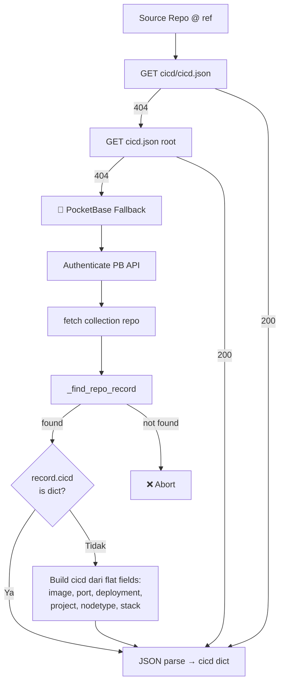
```mermaid
flowchart TD
    S["Source Repo @ ref"] --> G1["GET cicd/cicd.json"]
    G1 -->|"404"| G2["GET cicd.json root"]
    G2 -->|"404"| PB["🔄 PocketBase Fallback"]
    G1 -->|"200"| PARSE["JSON parse → cicd dict"]
    G2 -->|"200"| PARSE
    PB --> PB_AUTH["Authenticate PB API"]
    PB_AUTH --> PB_FETCH["fetch collection repo"]
    PB_FETCH --> PB_FIND["_find_repo_record"]
    PB_FIND -->|"found"| PB_CICD{"record.cicd<br/>is dict?"}
    PB_CICD -->|"Ya"| PARSE
    PB_CICD -->|"Tidak"| PB_FLAT["Build cicd dari flat fields:<br/>image, port, deployment,<br/>project, nodetype, stack"]
    PB_FLAT --> PARSE
    PB_FIND -->|"not found"| FAIL["❌ Abort"]
```

### 6.8.2 Stack Detection Waterfall (detail Step 3)

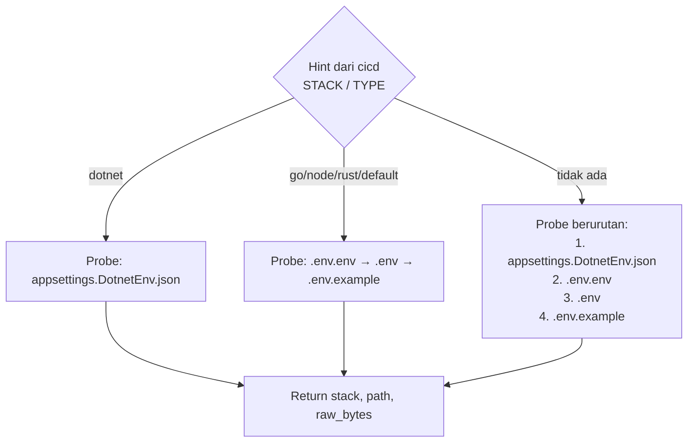
```mermaid
flowchart TD
    HINT{"Hint dari cicd<br/>STACK / TYPE"}
    HINT -->|"dotnet"| D["Probe: appsettings.DotnetEnv.json"]
    HINT -->|"go/node/rust/default"| E["Probe: .env.env → .env → .env.example"]
    HINT -->|"tidak ada"| F["Probe berurutan:<br/>1. appsettings.DotnetEnv.json<br/>2. .env.env<br/>3. .env<br/>4. .env.example"]
    D --> R["Return stack, path, raw_bytes"]
    E --> R
    F --> R
```

### 6.8.3 Commit → Push → PR Sequence

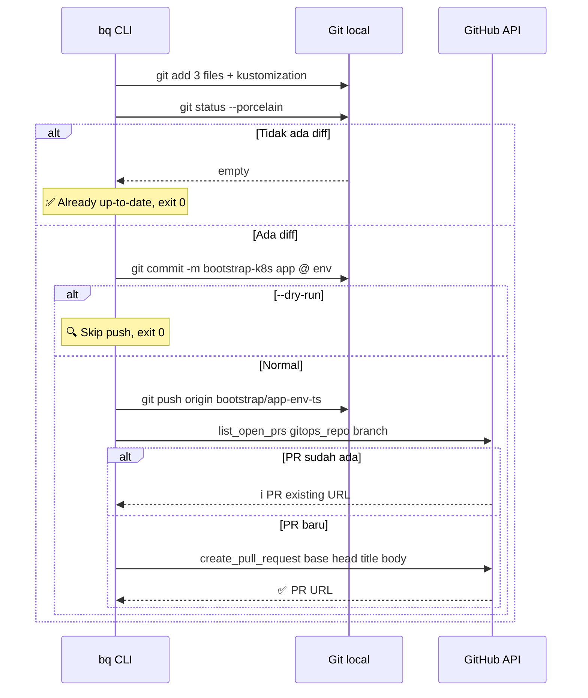
```mermaid
sequenceDiagram
    participant BQ as bq CLI
    participant GIT as Git local
    participant GH as GitHub API

    BQ->>GIT: git add 3 files + kustomization
    BQ->>GIT: git status --porcelain
    
    alt Tidak ada diff
        GIT-->>BQ: empty
        Note over BQ: ✅ Already up-to-date, exit 0
    else Ada diff
        BQ->>GIT: git commit -m bootstrap-k8s app @ env
        
        alt --dry-run
            Note over BQ: 🔍 Skip push, exit 0
        else Normal
            BQ->>GIT: git push origin bootstrap/app-env-ts
            BQ->>GH: list_open_prs gitops_repo branch
            
            alt PR sudah ada
                GH-->>BQ: ℹ️ PR existing URL
            else PR baru
                BQ->>GH: create_pull_request base head title body
                GH-->>BQ: ✅ PR URL
            end
        end
    end
```

**Standar file yang di-generate ke `{path-yaml}/`:**
- `file-config/{app}-{env}.yaml` — Secret data `.env` (default) atau `appsettings.{Env}.json` (dotnet)
- `{app}_deployment.yaml` — 4-tuple labels, RollingUpdate, imagePullSecrets, nodeSelector, tz-config
- `{app}_services.yaml` — ClusterIP, targetPort `http`
- `kustomization.yaml` — append entries

**Selector consistency guarantee:** `spec.selector.matchLabels`, `spec.template.metadata.labels`, dan Service `spec.selector` dirender dari placeholder `{{APP}}` tunggal → tidak mungkin mismatch by construction.

### 6.9 `--cicd-trigger` Flow (manual webhook trigger)

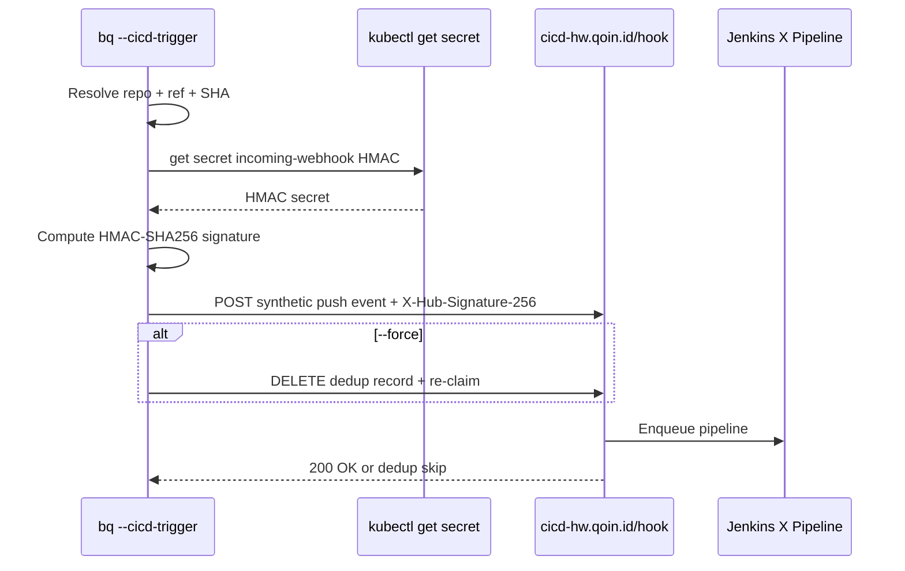
```mermaid
sequenceDiagram
    participant Dev as bq --cicd-trigger
    participant K8s as kubectl get secret
    participant WH as cicd-hw.qoin.id/hook
    participant JX as Jenkins X Pipeline

    Dev->>Dev: Resolve repo + ref + SHA
    Dev->>K8s: get secret incoming-webhook HMAC
    K8s-->>Dev: HMAC secret
    Dev->>Dev: Compute HMAC-SHA256 signature
    Dev->>WH: POST synthetic push event + X-Hub-Signature-256
    
    alt --force
        Dev->>WH: DELETE dedup record + re-claim
    end
    
    WH->>JX: Enqueue pipeline
    WH-->>Dev: 200 OK or dedup skip
```

### 6.10 `--set-image` / `--gitops-set-image` / `--is-match-image` Flows


```mermaid
flowchart TD
    subgraph SetImage["--set-image ns deploy image"]
        SI1["kubectl set image deploy/app container=image"] --> SI2["kubectl rollout status --watch"]
    end
    subgraph GitopsSetImage["--gitops-set-image repo branch path image"]
        GI1["Pre-flight: file exist di GitHub?"] --> GI2["Pre-flight: image ready di Docker Hub?"]
        GI2 --> GI3["Pre-flight: duplikasi? same image already?"]
        GI3 --> GI4["Patch YAML: update image field"]
        GI4 --> GI5["commit + push langsung ke branch"]
    end
    subgraph IsMatchImage["--is-match-image ns deploy repo branch path"]
        IM1["kubectl get deploy → image live"] --> IM2["gh api → image di YAML GitOps"]
        IM2 --> IM3{"Match?"}
        IM3 -- yes --> IM4["✅ In sync"]
        IM3 -- no --> IM5["⚠️ MISMATCH<br/>suggest: bq --gitops-set-image ..."]
    end
```

### 6.11 PocketBase IDP Credential Flow

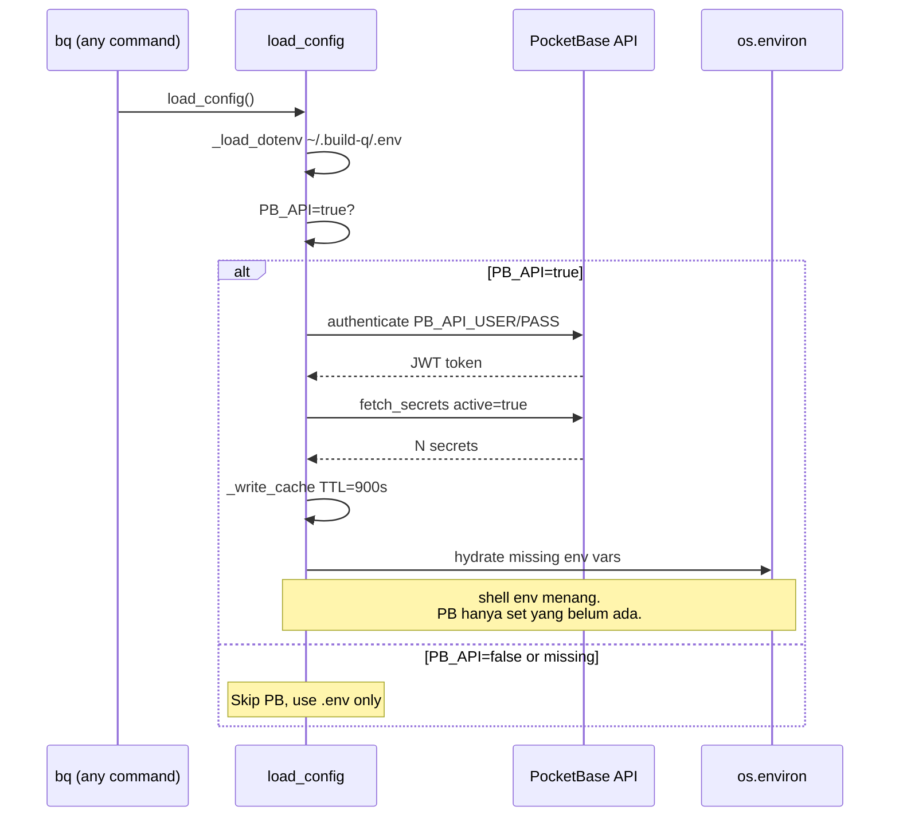
```mermaid
sequenceDiagram
    participant BQ as bq (any command)
    participant CFG as load_config
    participant PB as PocketBase API
    participant ENV as os.environ

    BQ->>CFG: load_config()
    CFG->>CFG: _load_dotenv ~/.build-q/.env
    CFG->>CFG: PB_API=true?
    
    alt PB_API=true
        CFG->>PB: authenticate PB_API_USER/PASS
        PB-->>CFG: JWT token
        CFG->>PB: fetch_secrets active=true
        PB-->>CFG: N secrets
        CFG->>CFG: _write_cache TTL=900s
        CFG->>ENV: hydrate missing env vars
        Note over CFG,ENV: shell env menang.<br/>PB hanya set yang belum ada.
    else PB_API=false or missing
        Note over CFG: Skip PB, use .env only
    end
```

### 6.7 Onboarding Journey (Pemula, 5 menit pertama)

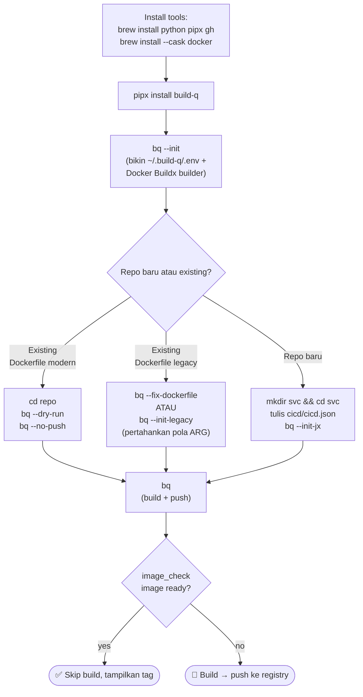
```mermaid
flowchart TD
    A["Install tools:<br/>brew install python pipx gh<br/>brew install --cask docker"] --> B["pipx install build-q"]
    B --> C["bq --init<br/>(bikin ~/.build-q/.env +<br/>Docker Buildx builder)"]
    C --> D{"Repo baru atau existing?"}
    D -- Existing<br/>Dockerfile modern --> E1["cd repo<br/>bq --dry-run<br/>bq --no-push"]
    D -- Existing<br/>Dockerfile legacy --> E2["bq --fix-dockerfile<br/>ATAU<br/>bq --init-legacy<br/>(pertahankan pola ARG)"]
    D -- Repo baru --> E3["mkdir svc && cd svc<br/>tulis cicd/cicd.json<br/>bq --init-jx"]
    E1 & E2 & E3 --> F["bq<br/>(build + push)"]
    F --> G{"image_check<br/>image ready?"}
    G -- yes --> H(["✅ Skip build, tampilkan tag"])
    G -- no --> I(["🔨 Build → push ke registry"])
```

---

## 7. Key Features

### 7.1 Git Auto-detection

Bila `<repo>` / `<ref>` tidak diberikan, CLI membaca dari Git lokal:

- `repo` ← nama dari `git remote get-url origin` (fallback: nama direktori).
- `ref` ← `git rev-parse --abbrev-ref HEAD` (fallback: tag `git describe --tags --exact-match`, lalu short SHA jika detached HEAD).

### 7.2 CI/CD Config Integration (`cicd/cicd.json`)

Membaca field:

- `IMAGE` → nama image.
- `PORT`, `PORT2`, `PROJECT` → dipetakan otomatis ke `--build-arg`.
- `CLUSTER`, `DEPLOYMENT`, `NODETYPE` → dipakai `--init-jx` sebagai konteks template.

### 7.3 Smart Ref → ENV Mapping

Helper terpusat `_env_from_ref(ref)` menyimpulkan environment dari nama branch/tag. Nilainya dipakai:

- Sebagai `--build-arg BRANCH=<env>` di `build_command` (buildx path — local, `--clone`, `--remote`).
- Sebagai `ENV=<env>` argument ke `make build && make release` di `run_compose` (mode `--compose`).

**INLINE dengan Tekton pipeline** di `~/jenkins-x/pipeline` (lighthouse
`triggers.yaml` + `webhook-server.py`). Aturan case shell yang di-mirror
exact di `_env_from_ref()`:

| Ref (branch/tag) | ENV | IMAGE_TAG |
| ------------------ | ----- | --------- |
| `v1.2.3`, `refs/tags/v*` | `production` | basename ref (`v1.2.3`) |
| `develop` | `develop` | short SHA |
| `staging` | `staging` | short SHA |
| `sandbox` | `sandbox` | short SHA |
| `main`, `master`, unknown, kosong | `staging` (Tekton fallback `*)`) | short SHA |

Catatan penting: push ke `main`/`master` **tidak** memicu production di JX;
tag `v*` yang memicu. Override manual: `--build-arg BRANCH=custom` menang.

### 7.4 Default Secret `netrc`

Selalu menambahkan `--secret id=netrc,src=$HOME/.netrc` (untuk dependency privat), kecuali user sudah menyertakan secret dengan id yang sama.

### 7.5 Registry Idempotency Check (Early Skip)

`docker buildx imagetools inspect {tag}` dijalankan **paling awal** di `run_build` (dan `run_compose`) — sebelum `ensure_builder` dan validasi `cicd.json`. Bila image ready → cetak `✅ Image ready: {tag}` dan `exit 0` tanpa side effect apa pun. Bypass via `--no-image-check` / `--rebuild`.

### 7.6 Mode Sumber Kode

- **Local (default)**: build dari direktori kerja saat ini.
- **`--clone <owner/repo>`**: clone via `gh` CLI ke direktori kerja, lalu build. `--clean` menghapus direktori clone setelah selesai. Pre-clone image check memakai commit SHA dari `gh api` — kalau image ready, tidak jadi clone.
- **`--remote`**: build langsung dari Git context (`git_url#ref`) — tidak clone lokal. `cicd.json` diambil via `gh api contents`. Commit hash via `gh api commits/{ref}`.
  - **SSH fallback**: bila `SSH_AUTH_SOCK` kosong, otomatis pindah ke HTTPS + `GIT_AUTH_TOKEN` secret (via `gh auth token`) supaya Buildx Git context tetap jalan tanpa `ssh-agent`.

### 7.7 Resource Limits

Default aman untuk laptop: `--memory 4g`, `--cpu-period 100000`, `--cpu-quota 200000` (dapat di-override via `~/.build-q/.env`).

### 7.8 Auto Tag

Bila `--tag` tidak diberikan: `{REGISTRY_URL}/{IMAGE}:{short_commit}` (7 karakter). Rumus identik antara `_predict_image_tag()` (untuk early check) dan `build_command()` (untuk eksekusi).

### 7.9 Dry Run

`--dry-run` mencetak command yang akan dijalankan tanpa eksekusi. Early image check di-skip pada dry-run supaya user selalu melihat command lengkapnya.

### 7.10 Konfigurasi Terpusat

File `~/.build-q/.env`:

| Variable | Default |
| ---------- | --------- |
| `BUILDER_NAME` | `mybuilder` |
| `REGISTRY_URL` | `loyaltolpi` |
| `DEFAULT_MEMORY` | `4g` |
| `DEFAULT_CPU_PERIOD` | `100000` |
| `DEFAULT_CPU_QUOTA` | `200000` |
| `GIT_SSH_PREFIX` | `git@github.com:` |
| `GITHUB_ORG` | (kosong) |
| `WEBHOOK_TRIGGER_URL` | `https://cicd-hw.qoin.id/trigger` |
| `JX_KUBE_CONTEXT` | (kosong = current) |
| `JX_KUBE_NAMESPACE` | `jenkins-x` |
| `JX_TOKEN_SECRET` | `webhook-trigger-token` |

Perintah bantuan: `bq --init` (buat file + init Buildx builder), `bq --config` (tampilkan aktif).

### 7.11 Auto-init Docker Buildx Builder

`bq --init` (dan `run_build` sebagai safety net *setelah* early image check) memanggil `ensure_builder(name)` yang:

- `docker buildx inspect <name>` — cek eksistensi.
- Jika ada tetapi stdout memuat `Error:` (mis. endpoint Colima yang hilang) → `docker buildx rm -f` lalu re-create.
- Jika belum ada → `docker buildx create --name <name> --use [--bootstrap]`.

### 7.12 Scaffolding CI/CD Modern (`--init-jx`)

Generate 4 file dari `cicd/cicd.json`:

- `Makefile` — target `develop/staging/production/build/release/run`, BuildKit enabled.
- `compose.yaml` — service dengan `secrets: netrc` mount dari `$HOME/.netrc`.
- `Dockerfile` — multi-stage Go dengan `--mount=type=secret,id=netrc` (pola aman).
- `.github/workflows/trigger-ci.yml` — trigger webhook Jenkins X.

Placeholder `{{IMAGE}}/{{PROJECT}}/{{PORT}}/{{CLUSTER}}/{{DEPLOYMENT}}/{{NODETYPE}}/{{ORG_REGISTRY}}` disubstitusi dari `cicd.json` + config. Otomatis panggil `--init-secrets` bila `git remote origin` mengarah ke GitHub.

### 7.13 Scaffolding CI/CD Legacy (`--init-legacy`)

Untuk repo lama yang Dockerfile-nya masih pakai `ARG GITHUB_USER/GITHUB_TOKEN` (bukan BuildKit secret). Generate 2 file — **Dockerfile TIDAK ditimpa**:

- `Makefile` — auto-ambil `gh auth token` untuk `GITHUB_TOKEN` di local dev; support override `GIT_TOKEN` dari CI (mis. Tekton).
- `compose.yaml` — hybrid: mendukung Dockerfile legacy (build-arg) *dan* modern (secret mount).

### 7.14 Bootstrap Trigger CI Standar (`--gh-action-init`)

Menegakkan `trigger-ci.yml` sebagai **satu-satunya** workflow di `.github/workflows/`:

1. Hapus semua `*.yml`/`*.yaml` lain di `.github/workflows/` (workflow lama).
2. Tulis ulang `trigger-ci.yml` dari template.
3. Set `WEBHOOK_TRIGGER_URL` + `WEBHOOK_TRIGGER_TOKEN` via `gh secret set`.

Bisa dipakai berdiri sendiri di repo existing tanpa touch Makefile/Dockerfile.

### 7.15 GitHub Actions Webhook Secrets (`--init-secrets`)

Set dua secret di target repo:

- `WEBHOOK_TRIGGER_URL` — dari config `WEBHOOK_TRIGGER_URL`.
- `WEBHOOK_TRIGGER_TOKEN` — fetch otomatis via `kubectl get secret <JX_TOKEN_SECRET> -n <JX_KUBE_NAMESPACE>` lalu `base64 -d`.

Auto-detect target repo dari `git remote get-url origin` (parse `owner/repo`). Override manual via positional `bq --init-secrets <owner>/<repo>` atau `--token <VALUE>` untuk skip kubectl.

### 7.16 Migrasi Dockerfile Legacy (`--fix-dockerfile`)

Transformasi Dockerfile lama menjadi modern. Selain migrasi netrc, mencakup pembersihan directive deprecated:

- Normalisasi `FROM ... as ...` → `FROM ... AS ...`.
- Hapus `ARG GITHUB_USER` / `ARG GITHUB_TOKEN`.
- Rewrite `RUN sh -c '...'` dan `RUN echo ...` yang mem-build netrc dari ARG → `RUN --mount=type=secret,id=netrc,target=/root/.netrc \ ...`.
- **Standalone** `RUN echo "machine github.com ..." > ~/.netrc` (tanpa `&& chmod && cmd`) → dihapus, secret mount otomatis ditempel ke RUN yang berisi `go mod tidy/download` atau `go get`.
- `MAINTAINER foo` (deprecated) → `LABEL maintainer="foo"`.
- Legacy `ENV KEY value` (tanpa `=`) → `ENV KEY=value`.
- Backup ke `<path>.bak`.

### 7.17 GitHub Auth Injection (`--gh-auth`)

Untuk Dockerfile legacy yang belum dimigrasi: inject `--build-arg GITHUB_USER=$(gh api user --jq .login)` dan `--build-arg GITHUB_TOKEN=$(gh auth token)`. Token di-mask di log output (`GITHUB_TOKEN=***`); nilai asli diteruskan ke `docker buildx`.

### 7.18 GitHub Org Shorthand

Bila `GITHUB_ORG` di-set, positional `repo` yang tidak mengandung `/` atau scheme akan di-expand: `bq foo staging --remote` → `bq Qoin-Digital-Indonesia/foo staging --remote`.

### 7.19 Compose Mode (`--compose`)

Alternatif eksekusi build: jalankan `make build ENV=<env> && make release ENV=<env>` (bukan `docker buildx`). Cocok untuk repo yang alur build-nya sudah pakai Makefile + docker compose (mis. hasil `--init-jx` / `--init-legacy`).

- `ENV=<env>` disimpulkan lewat `_env_from_ref(ref)` — lihat §7.3 (mendukung `develop`/`staging`/`production` sesuai nama branch/tag).
- Tag prediction memakai `get_local_tag_or_commit()` yang paritas dengan Makefile (`git describe --tags --exact-match || git rev-parse --short HEAD`), sehingga early registry check mencocokkan tag yang akan di-push `make release`. Sejak v0.1.19 `bq` default (buildx) juga INLINE dengan aturan tag-first ini.
- Bisa digabung dengan `--clone`: `bq --clone owner/repo staging --compose` → clone → cd → `make build/release ENV=staging`.

### 7.20 Native GitHub REST + Git (`GH_CLI=false`, default sejak v0.1.22)

Menggantikan pemakaian `gh` CLI dengan `urllib` + `git` biasa. Cred disimpan di `~/.build-q/.env` (`GITHUB_TOKEN`, `GITHUB_USER`).

- `build_q/github_api.py` — stdlib wrapper: `get_contents_raw`, `get_commit_sha`, `get_user_login`, `get_auth_token`, `clone`, `set_secret` (butuh `pynacl`), `create_pull_request`, `list_open_prs`.
- Toggle `GH_CLI=true` masih tersedia untuk fallback ke `gh` CLI (deprecated, rencana hapus v0.2.0).
- Scope PAT minimum: `repo` + `workflow` + `read:user` (workflow wajib untuk `--pr-fix` yang menyentuh `.github/workflows/*`).

### 7.21 Rollout Suggestions Pasca-Build

Setelah build sukses (atau `--dry-run`), `bq` cetak 2 perintah siap copy-paste yang membungkus tools eksternal `set-image` (imperative `kubectl set image` + `rollout status --watch`) dan `gitops-set-image` (declarative patch YAML di repo GitOps + push).

- Path template GitOps: `{infra}/{ns}/{deployment}_deployment.yaml`. `infra=cce` (Huawei) default, `k8s` untuk SLS. Override: `--infra {cce,k8s}` atau `--gitops-path`.
- Namespace fallback: `--ns` > `<env>-<cicd.PROJECT>` > `<env>-<NS_SUFFIX>`. Sejak v0.1.22 `cicd.PROJECT` menang atas `NS_SUFFIX` global.
- Prefix image: `DOCKERHUB_ORG` bila di-set, else `REGISTRY_URL`.
- Suggestion hanya PRINT — tidak eksekusi.

### 7.22 Verifikasi Kesiapan Repo (`--check`)

`bq --check <repo> <ref> --remote` — cek tanpa clone: repo/ref accessible, cicd config valid, artifact `init-jx` exist **dan match template terkini** (byte compare setelah normalize), image di registry (tag-aware sejak v0.1.23), dan file deployment GitOps.

- Exit 0 bila wajib lulus (repo/ref + cicd), 1 bila miss.
- Warning `outdated:*` → suggestion `bq --pr-fix <repo> <ref>` otomatis dicetak.

### 7.23 One-Shot Fix (`--pr-fix`)

`bq --pr-fix <repo> <ref>` — 11 langkah otomatis: preflight → clone shallow → branch `fix/jx-init-<ts>` → regenerate 4 artifact via template + cicd ctx → commit → push → set 2 repo secrets (`WEBHOOK_TRIGGER_URL/TOKEN`) via libsodium → open PR ke `ref` → cleanup.

- Preflight: `GITHUB_TOKEN` (scope `workflow`), `WEBHOOK_TRIGGER_TOKEN` (auto-fetch dari k8s bila kosong, disimpan ke `.env`), `pynacl`.
- Flag: `--pr-branch NAME`, `--keep-workdir`, `--dry-run` (skip push/secrets/PR).
- Deduplikasi: bila PR untuk branch fix sudah open, print URL eksisting.
- Default `JX_KUBE_CONTEXT=hw-dev` (sejak v0.1.25).

### 7.24 Bootstrap Manifest K8s ke GitOps (`--bootstrap-k8s`, sejak v0.1.29)

`bq --bootstrap-k8s <repo> <ref> --gitops-repo <r> --gitops-branch <b> --path-yaml <p>` — one-shot bootstrap Kubernetes manifest ke repo GitOps sesuai standar Qoin CCE. Flow lengkap ada di §6.8.

**CICD Config source (waterfall, detail di §6.8.1):**
1. `cicd/cicd.json` di source repo (GitHub REST API)
2. `cicd.json` di root source repo
3. **PocketBase fallback** (sejak v0.1.30) — collection `repo`, field `cicd` (nested dict) atau flat fields (`image`, `port`, `deployment`, `project`, `nodetype`, `stack`)

Repo tanpa `cicd/cicd.json` (mis. repo Rust yang pure) bisa di-bootstrap selama datanya ada di PocketBase. Update via PB admin UI atau API PATCH.

**Yang di-generate ke `{path-yaml}/`:**
- `file-config/{app}-{env}.yaml` — Secret (data key `.env` untuk go/node/rust, `appsettings.{Env}.json` untuk dotnet), base64 dari config file source
- `{app}_deployment.yaml` — Deployment: labels 4-tuple `{app,env,project,role}` (selector immutable — match template.labels), `imagePullSecrets: [{name: regcred}]`, `nodeSelector: cce.cloud.com/cce-nodepool: <nodepool>`, `imagePullPolicy: Always`, `RollingUpdate` strategy, tz-config volume `/etc/localtime`, secret volume mount ke `/.env` atau `/app/appsettings.{Env}.json`
- `{app}_services.yaml` — Service ClusterIP, `targetPort: http` (named port), selector 1-tuple `{app: X}` (subset match — cocok dengan pod 4-tuple)
- `kustomization.yaml` — append 2 entries di `resources:` (idempotent — skip bila sudah ada)

**Output file structure:**
```
{gitops-repo}/
└── {path-yaml}/                            # cce/develop-qoin/
    ├── kustomization.yaml                   # ← updated (idempotent)
    ├── file-config/
    │   └── {app}-{env}.yaml                 # ← Secret
    ├── {app}_deployment.yaml                # ← Deployment
    └── {app}_services.yaml                  # ← Service
```

**Stack auto-detect (probe berurutan di source repo `{repo}@{ref}`, detail di §6.8.2):**
1. `appsettings.{DotnetEnv}.json` → dotnet
2. `.env.{env}` → default
3. `.env` → default
4. `.env.example` → default (⚠️ template — value dummy)

Override: `--stack {dotnet|default}`.

**Env derivation dari `<ref>`:**
- `develop` → develop / Development
- `staging` → staging / Staging
- `sandbox` → sandbox / Sandbox
- `main` / `master` / tag `v*` → production / Production

Override: `--env NAME` (contoh cross-env: `--env staging` walau source ref `main`).

**Render context (12 variabel):**

| Key | Sumber | Contoh |
|-----|--------|--------|
| `APP` | `cicd.DEPLOYMENT` → `cicd.IMAGE` → repo name | `plus-be-rustcreateordersnap-manager` |
| `ENV` | Derived dari ref | `develop` |
| `NAMESPACE` | Segmen terakhir `--path-yaml` | `develop-qoin` |
| `DOTNET_ENV` | Mapped dari env | `Development` |
| `REPLICAS` | `--replicas` (default: 2) | `2` |
| `IMAGE_FULL` | `{registry}/{IMAGE}:{sha7}` | `loyaltolpi/plus-be-rustcreateordersnap-manager:074b14b` |
| `PORT` | `cicd.PORT` (default: 8080) | `2323` |
| `PROJECT` | `cicd.PROJECT` (default: qoin) | `qoin` |
| `ROLE` | `cicd.NODETYPE` (default: back) | `back` |
| `NODEPOOL` | `{namespace}-{suffix}` | `develop-qoin-service` |
| `IMAGE_PULL_SECRET` | `--image-pull-secret` (default: regcred) | `regcred` |
| `CONFIG_B64` | `base64(config_raw)` | `QVBQX05BTUUu...` |

**Image tag rule** (mirror Makefile `IMAGE_TAG`): ref cocok pola tag `v\d*` → pakai ref (e.g. `v1.0.0`); selain itu → short SHA 7 char (e.g. `074b14b`).

**Nodepool derivation:** `{namespace}-{manager|service}` — manager kalau `cicd.NODETYPE=front`, service kalau `back`. Override: `--nodepool NAME` (mis. `production-nodepool-service` untuk cluster hw-pro-q yang pakai pattern berbeda).

**Namespace decoupling (cross-env):** default `namespace` diambil dari segmen terakhir `--path-yaml` (mis. `cce/develop-qoin` → `develop-qoin`). Override: `--namespace NAME` — berguna saat gitops folder di `cce/staging-qoin/` tapi apply real ke `production-qoin` di cluster prod.

**Opsional side-effects ke cluster (opt-in):**
- `--apply-secret` + `--kube-context CTX` → kubectl apply Secret bila belum ada. **Guardrail production:** refuse (`env=production` → PR-only, wajib review). Idempotent — skip bila sudah ada.
- `--force-recreate-deploy` + `--kube-context CTX` → cek `spec.selector.matchLabels` cluster vs rendered; kalau drift → `kubectl delete deploy` (ArgoCD selfHeal akan re-create dari GitOps spec baru). K8s `spec.selector` IMMUTABLE, tanpa recreate apply akan reject. **Guardrail production:** refuse (production wajib manual blue-green/canary).

**Idempotency guarantee:**
- Secret sudah ada → skip apply
- YAML content sama dengan origin → 0 git diff → skip commit
- Kustomization entry sudah include → skip update
- Selector match / Deployment belum ada → skip recreate
- 0 diff sama sekali → print "already up-to-date" + exit 0 tanpa PR
- PR sudah open dengan same `head.ref` → print existing URL, skip create

**Selector consistency by construction:** template pakai placeholder `{{APP}}` tunggal untuk `spec.selector.matchLabels`, `spec.template.metadata.labels`, dan Service `spec.selector`. Satu render → tidak mungkin drift.

**Failure mode terobservasi (dari incident nyata):**
| Symptom | Cause | Mitigation |
|---|---|---|
| `ImagePullBackOff` (`unexpected media type text/html`) | Docker Hub rate-limit anon pull | Template include `imagePullSecrets: regcred` sejak v0.1.29 |
| `spec.selector: field is immutable` | Old deploy 1-tuple, new 4-tuple | `--force-recreate-deploy` (non-prod) |
| Pod crash `Env X required` | `.env.example` = template placeholder | Patch Secret manual + rollout restart |
| PR konflik `kustomization.yaml` | PR paralel merge duluan | Close & re-run (idempotent dari HEAD baru) |
| `cicd config tidak ada` | Repo tanpa cicd.json, PB record kosong | Update PB collection `repo` via API PATCH |

**Template source (gist → cache → bundled fallback):**

| Template Name | Gist File | Dipakai Untuk |
|---------------|-----------|---------------|
| `secret_default` | `secret.default.yaml` | Secret stack default (Go/Node/Rust) |
| `secret_dotnet` | `secret.dotnet.yaml` | Secret stack dotnet |
| `deployment_default` | `deployment.default.yaml` | Deployment stack default |
| `deployment_dotnet` | `deployment.dotnet.yaml` | Deployment stack dotnet |
| `services` | `services.yaml` | Service (shared) |

Cache TTL: 3600s (1 jam). Jika gist unreachable, fallback ke bundled template di `templates.py`.

**Flag lengkap:**

| Flag | Default | Keterangan |
|---|---|---|
| `--gitops-repo OWNER/REPO` | wajib | Target repo GitOps |
| `--gitops-branch BRANCH` | wajib | Base branch untuk PR |
| `--path-yaml PATH` | wajib | Folder tujuan (mis. `cce/develop-qoin`) — **bukan** file path |
| `--namespace NAME` | dari path-yaml | Override K8s namespace |
| `--nodepool NAME` | `{ns}-{svc\|manager}` | Override CCE nodepool selector |
| `--env NAME` | dari ref | Override env label |
| `--stack {dotnet,default}` | auto | Paksa stack |
| `--replicas N` | 2 | Replicas Deployment |
| `--image-pull-secret NAME` | `regcred` | Nama imagePullSecret |
| `--apply-secret` | off | kubectl apply Secret (opt-in, non-prod) |
| `--kube-context NAME` | current | kubectl context |
| `--force-recreate-deploy` | off | Delete deploy saat drift (opt-in, non-prod) |
| `--dry-run` | execute | Skip push/PR |
| `--keep-workdir` | delete | Simpan workdir untuk inspeksi |

**Contoh real execution:**
```
$ bq --bootstrap-k8s plus-be-rustcreateordersnap-manager develop \
     --gitops-repo Qoin-Digital-Indonesia/gitops \
     --gitops-branch develop \
     --path-yaml cce/develop-qoin

🔐 Preflight:
   ✅ GITHUB_TOKEN (40 chars)
📐 Derived: env=develop  namespace=develop-qoin (dari path-yaml)
📡 Fetch cicd config ...
   ⚠️  cicd config tidak ada di repo (tried: cicd/cicd.json, cicd.json)
   🔄 Fallback: cek PocketBase collection 'repo' ...
   ✅ PocketBase/repo.cicd — IMAGE=plus-be-rustcreateordersnap-manager PORT=2323
🔍 Deteksi stack ...
   ✅ stack=default  source=.env.example  size=346B
🧩 Render context: APP=plus-be-rustcreateordersnap-manager  ENV=develop ...
📥 Clone gitops → /tmp/bq-bootstrap-...
🌿 Branch: bootstrap/plus-be-rustcreateordersnap-manager-develop-...
📝 Render 3 file YAML
📦 Commit ... ✅ 3 file
🚀 Push → origin/bootstrap/...
🔀 Open PR → develop
   ✅ https://github.com/Qoin-Digital-Indonesia/gitops/pull/577
🧹 Cleanup
```

### 7.25 PocketBase IDP — Centralized Credentials (`--pb-*`, sejak v0.1.27)

PocketBase-based Identity Provider untuk zero-local-config workflow. Engineer hanya perlu `PB_API_URL`, `PB_API_USER`, `PB_API_PASS` — seluruh secret (`GITHUB_TOKEN`, `DOCKERHUB_TOKEN`, `WEBHOOK_HOOK_HMAC`, dll) di-hydrate dari PB API sebelum `load_config()` baca env vars.

| Subcommand | Aksi |
|------------|------|
| `--pb-login` | Auth + warm cache |
| `--pb-status` | Tampilkan URL, user, cache age, jumlah secrets |
| `--pb-pull` | Force refresh (skip TTL) |
| `--pb-logout` | Hapus `~/.build-q/.pb-cache.json` |

**Hydration priority:** shell env > PB API > `.env` file > defaults. PB hanya set key yang **belum ada** di `os.environ`. Bootstrap keys (`PB_API*`) tidak pernah di-overlay (chicken-and-egg guard).

**Cache:** `~/.build-q/.pb-cache.json`, TTL default 900s (15 menit), mode 0600.

**Resilient:** bila PB API unreachable → warning ke stderr, fallback ke `.env` lokal, tidak pernah abort.

### 7.26 Verifikasi Webhook (`--cicd-webhook`)

`bq --cicd-webhook [<repo>]` — cek apakah repo sudah terpasang webhook `cicd-hw.qoin.id/hook`. Auto-detect repo dari git remote bila tidak diberikan. Dapat juga berjalan berbarengan dengan `--pr-fix` (dijalankan setelah pr-fix sukses).

### 7.27 Manual Pipeline Trigger (`--cicd-trigger`)

`bq --cicd-trigger <repo> <ref> [--sha SHA] [--force] [--dry-run]` — trigger MANUAL pipeline via webhook `cicd-hw.qoin.id/hook`. Mengirim synthetic push event dengan HMAC-SHA256 signature. HMAC diambil dari secret `jenkins-x/incoming-webhook` (context `hw-dev`) atau env `INCOMING_WEBHOOK_HMAC`.

- `--force`: bypass middleware dedup (delete dedup record lama + claim baru) — berguna untuk re-run commit yang sama.
- Auto-detect repo/ref dari git remote bila tidak diberikan.

### 7.28 Hot-patch Deployment via kubectl (`--set-image`)

`bq --set-image <ns> <deployment> <image> [container]` — hot-patch K8s Deployment via `kubectl set image` + `kubectl rollout status --watch`. Bila `<image>` tanpa `/`, otomatis expand ke `{REGISTRY_URL}/{deployment}:{image}`.

### 7.29 GitOps Image Update (`--gitops-set-image`)

`bq --gitops-set-image <gitops-repo> <branch> <path.yaml> <image_full>` — update image di deployment YAML di repo GitOps, commit + push langsung ke branch (tanpa PR). Pre-flight: file exist di GitHub, image ready di Docker Hub, duplikasi check.

### 7.30 Image Drift Check (`--is-match-image`)

`bq --is-match-image <ns> <deployment> <gitops-repo> <branch> <path.yaml>` — bandingkan image `container[0]` Deployment K8s (live) dengan image di file deployment YAML repo GitOps. Kalau MISMATCH, cetak perintah `bq --gitops-set-image` untuk sync.

### 7.31 Repo Config Check dari PocketBase (`--repo-check`)

`bq --repo-check <repo> [<ref>] [--cicd=pb] [--dry-run]` — cek CICD repo config dari PocketBase collection `repo`. Menampilkan konfigurasi CICD repo (IMAGE, PROJECT, DEPLOYMENT, PORT, dll) tanpa perlu clone. Berguna untuk verifikasi data sebelum menjalankan `--bootstrap-k8s`.

### 7.32 Preflight Diagnostik (`--doctor`)

`bq --doctor` — cek kesiapan tools (git, docker, buildx, kubectl) & credentials (GITHUB_TOKEN, docker login, buildx builder, kubectl context). Exit 0 bila blocker-free, exit 1 bila ada masalah kritis.

---

## 8. CLI Contract

```
bq [<repo> [<ref>]] [OPTIONS]
```

Flag penting: `--local`, `--remote`, `--clone <owner/repo>`, `--clean`, `--compose`, `--cicd <path>`, `--context <dir>`, `-f/--dockerfile`, `-t/--tag`, `--push/--no-push`, `--image-check/--no-image-check/--rebuild`, `--platform`, `--build-arg`, `--secret`, `--gh-auth`, `--dry-run`, `--init`, `--force`, `--config`, `--init-jx`, `--init-legacy`, `--gh-action-init`, `--init-secrets`, `--fix-dockerfile [PATH]`, `--token`, `--version`. **Sejak v0.1.18+:** `--ns <name>`, `--infra {cce,k8s}`, `--gitops-path <path>` (rollout overrides). **Sejak v0.1.22+:** `--check`. **Sejak v0.1.24+:** `--pr-fix`, `--pr-branch <name>`, `--keep-workdir`. **Sejak v0.1.29+:** `--bootstrap-k8s`, `--gitops-repo`, `--gitops-branch`, `--path-yaml`, `--namespace`, `--nodepool`, `--env`, `--stack`, `--replicas`, `--image-pull-secret`, `--apply-secret`, `--kube-context`, `--force-recreate-deploy`.

Default: `--push=True`, `--image-check=True`, `--platform=linux/amd64`, secret `netrc` otomatis.

## 9. Arsitektur

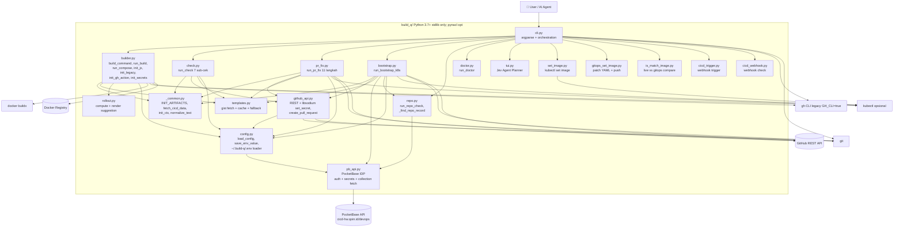
```mermaid
flowchart TB
    User["👤 User / AI Agent"] --> CLI
    subgraph Package["build_q/ Python 3.7+ stdlib only; pynacl opt"]
      CLI["cli.py<br/>argparse + orchestration"]
      Builder["builder.py<br/>build_command, run_build,<br/>run_compose, init_jx, init_legacy,<br/>init_gh_action, init_secrets"]
      Bootstrap["bootstrap.py<br/>run_bootstrap_k8s"]
      Check["check.py<br/>run_check 7 sub-cek"]
      PRFix["pr_fix.py<br/>run_pr_fix 11 langkah"]
      Rollout["rollout.py<br/>compute + render suggestion"]
      GhApi["github_api.py<br/>REST + libsodium set_secret,<br/>create_pull_request"]
      PbApi["pb_api.py<br/>PocketBase IDP<br/>auth + secrets + collection fetch"]
      Repo["repo.py<br/>run_repo_check,<br/>_find_repo_record"]
      SetImage["set_image.py<br/>kubectl set image"]
      GitopsSetImage["gitops_set_image.py<br/>patch YAML + push"]
      IsMatchImage["is_match_image.py<br/>live vs gitops compare"]
      CicdTrigger["cicd_trigger.py<br/>webhook trigger"]
      CicdWebhook["cicd_webhook.py<br/>webhook check"]
      Doctor["doctor.py<br/>run_doctor"]
      TUI["tui.py<br/>Jev Agent Planner"]
      Common["_common.py<br/>INIT_ARTIFACTS, fetch_cicd_data,<br/>init_ctx, normalize_text"]
      Config["config.py<br/>load_config, save_env_value,<br/>~/.build-q/.env loader"]
      Templates["templates.py<br/>gist fetch + cache + fallback"]
      CLI --> Builder & Check & PRFix & Bootstrap & Repo & Doctor & TUI
      CLI --> SetImage & GitopsSetImage & IsMatchImage & CicdTrigger & CicdWebhook
      Check & PRFix --> Common & GhApi & Templates
      Bootstrap --> Common & GhApi & Templates & PbApi & Repo
      Builder --> Common & Templates & Rollout
      Builder & Check & PRFix & Bootstrap --> Config
      Config --> PbApi
      GhApi --> Config
      Repo --> PbApi
    end
    Builder --> Docker["docker buildx"]
    Builder & CLI --> Gh["gh CLI legacy GH_CLI=true"]
    Builder & PRFix & Bootstrap & SetImage --> Kubectl["kubectl opsional"]
    Builder --> Registry[("Docker Registry")]
    CLI & GhApi & PRFix & Bootstrap --> Git["git"]
    GhApi & PRFix & Bootstrap --> GitHub[("GitHub REST API")]
    PbApi --> PocketBase[("PocketBase API<br/>cicd-hw.qoin.id/devops")]
```

Distribusi via `pyproject.toml` (setuptools) → dua entry point script: `build-q` & `bq`.

## 10. Technical Requirements

- Python 3.7+ (standard library only).
- Docker Engine + Buildx plugin.
- Git (opsional; wajib untuk auto-detect & mode local).
- GitHub credential: `GITHUB_TOKEN` di `~/.build-q/.env` (scope: `repo`, `workflow`, `read:user`). GitHub CLI `gh` opsional (mode legacy `GH_CLI=true`; default sejak v0.1.22: `GH_CLI=false` = native REST). Alternatif: PocketBase IDP (`PB_API=true`) — zero-local-config.
- `kubectl` (opsional; untuk fetch webhook token otomatis pada `--pr-fix` preflight; default context `hw-dev`; juga dipakai `--apply-secret`, `--force-recreate-deploy`, `--set-image`).
- `pynacl` (opsional; wajib untuk `--pr-fix` dan `--init-secrets` di mode native — enkripsi libsodium repo secret).
- PocketBase API credential (opsional; `PB_API_URL`, `PB_API_USER`, `PB_API_PASS` — wajib untuk `--pb-*` commands dan `--bootstrap-k8s` PocketBase fallback).

## 11. Release Process

`Makefile` menyediakan `make build` dan `make release [V=x.y.z]`:

1. `scripts/bump_version.py` bump patch version di `pyproject.toml` + `build_q/__init__.py`.
2. Build sdist + wheel via `python3 -m build` (fallback: `pipx run --spec build pyproject-build`).
3. Install lokal editable via `pipx install -e . --force`.
4. Upload ke PyPI via `pipx run twine upload --skip-existing dist/*` — kredensial dari `~/.pypirc`.

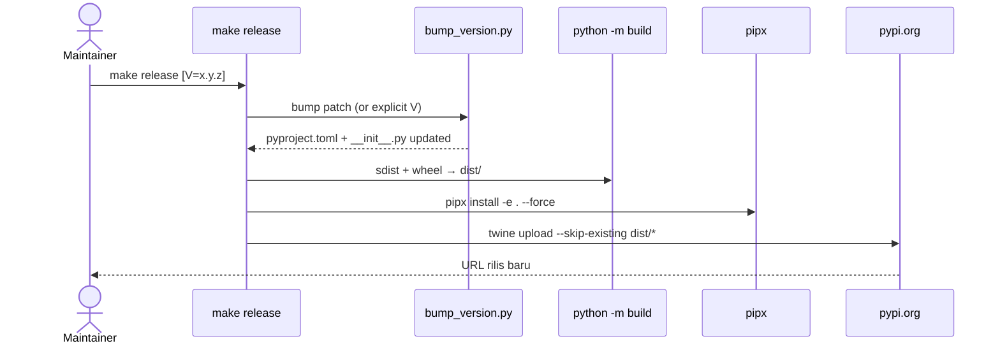
```mermaid
sequenceDiagram
    actor Maintainer
    participant Make as make release
    participant Bump as bump_version.py
    participant Build as python -m build
    participant Pipx as pipx
    participant PyPI as pypi.org

    Maintainer->>Make: make release [V=x.y.z]
    Make->>Bump: bump patch (or explicit V)
    Bump-->>Make: pyproject.toml + __init__.py updated
    Make->>Build: sdist + wheel → dist/
    Make->>Pipx: pipx install -e . --force
    Make->>PyPI: twine upload --skip-existing dist/*
    PyPI-->>Maintainer: URL rilis baru
```

## 12. Success Metrics

- **Adoption**: jumlah repo di organisasi yang punya `cicd/cicd.json` kompatibel dan memakai `bq` untuk build lokal.
- **Konsistensi**: image hasil `bq` bit-identical dengan hasil pipeline untuk commit yang sama.
- **Time-to-image**: waktu build ulang berkurang (dengan early `--image-check` skip build redundan tanpa bootstrap builder).
- **Bootstrap time**: repo baru dari nol → CI/CD siap dalam < 2 menit (`bq --init-jx` + `git push`).

## 13. Changelog Ringkas

- **0.1.30** — `--bootstrap-k8s` **PocketBase fallback**: bila `cicd/cicd.json` tidak ada di source repo, otomatis coba fetch dari PocketBase collection `repo` (nested `cicd` dict → flat fields fallback). Memungkinkan repo tanpa cicd.json (misal Rust services) tetap bisa di-bootstrap selama data CICD terdaftar di PocketBase IDP. Tambah modul import `pb_api` + `repo._find_repo_record` di `bootstrap.py`. Dokumentasi §6.8.1 (CICD waterfall), §7.25 (PB IDP), §7.26–7.32 (fitur baru). PRD §6.1 command router update 15+ subcommands.
- **0.1.29** — `bq --bootstrap-k8s`: one-shot bootstrap manifest K8s (Secret + Deployment + Service + kustomization) ke repo GitOps sesuai standar Qoin CCE. Modul baru `bootstrap.py`; 5 template YAML baru di gist (secret/deployment × dotnet/default + services); auto-detect stack (probe `appsettings.{Env}.json` → `.env.{env}` → `.env` → `.env.example`); labels 4-tuple `{app,env,project,role}` dengan selector by construction (impossible mismatch); `imagePullSecrets: regcred` + `nodeSelector: cce.cloud.com/cce-nodepool` + tz-config volume + `imagePullPolicy: Always` + `RollingUpdate` strategy; auto-update `kustomization.yaml` (idempotent); flag `--namespace`/`--nodepool`/`--env` override untuk cross-env (mis. gitops di `staging-qoin/` tapi apply ke `production-qoin`); opsional `--apply-secret` (guardrail production PR-only) + `--force-recreate-deploy` (untuk selector-immutable drift, guardrail production manual). Dedupe PR filter by `head.ref` (fix false-positive dari GitHub API filter tanpa `owner:branch`). PR body + branch naming `bootstrap/{app}-{env}-{ts}`. Test end-to-end verified di 4 repo Rust ke `develop-qoin` (hw-dev) + cross-env `production-qoin` (hw-pro-q). Dokumentasi §6.8 + §7.24.
- **0.1.28** — `--pr-fix`: preserve existing Dockerfile (skip regenerate) — cegah overwrite kustomisasi tim.
- **0.1.27** — DRY refactor Fase 1: modul baru `_common.py` (`INIT_ARTIFACTS`, `fetch_cicd_data`, `init_ctx_from_cicd`, `normalize_text`); `github_api.normalize_repo` public; hapus 4× normalisasi repo inline + 2× cicd fetch loop di check/pr_fix + duplikat helper `_normalize`/`_init_ctx`. Zero-behavior-change (~165 LOC reduksi). PRD di-sync ke v0.1.27.
- **0.1.26** — UX fix: `--pr-fix` push gagal karena token kurang scope `workflow` → pesan 4-langkah perbaikan konkret + update template `.env`.
- **0.1.25** — Default `JX_KUBE_CONTEXT=hw-dev` (cluster JX Qoin) + error preflight informatif.
- **0.1.24** — `bq --pr-fix <repo> <ref>`: 11-langkah one-shot fix (branch + regenerate 4 artifact + push + set 2 repo secrets + open PR); modul baru `pr_fix.py`; `github_api.create_pull_request` + `list_open_prs`; `config.save_env_value`.
- **0.1.23** — `--check` tag-aware (`:v2.2.1` bukan `:280022c`) + init artifact MATCH template terkini (deteksi OUTDATED via render + normalize compare). Bonus: `_BUNDLED_DOCKERFILE` → raw string (fix SyntaxWarning + `\n` literal untuk `printf`).
- **0.1.22** — Fitur `bq --check`, default `GH_CLI=false`, ns fallback prefer `cicd.PROJECT` atas `NS_SUFFIX` global.
- **0.1.21** — Fix: `bq` default (buildx) auto-inject `GITHUB_USER/GITHUB_TOKEN` build-arg (INLINE dgn compose.yaml).
- **0.1.20** — Fix: pre-clone/pre-remote tag prediction hormati git tag ref (v1.0.1 → `:v1.0.1`, bukan `:64a92b4`).
- **0.1.19** — Fix: `bq` default (buildx) sinkron dgn `--compose` — kedua mode pakai `get_local_tag_or_commit()` (tag-first).
- **0.1.18** — Rollout suggestion pasca-build: `set-image` (imperative) + `gitops-set-image` (declarative GitOps). Flag `--ns`, `--infra`, `--gitops-path`. Config baru: `DOCKERHUB_*`, `GITOPS_*`, `NS_SUFFIX`. Modul `rollout.py`.
- **0.1.17** — Toggle `GH_CLI` + jalur native REST + git (`build_q/github_api.py`, stdlib `urllib`); `--init-secrets` native via `pynacl` + libsodium; cred `GITHUB_USER/TOKEN` di `~/.build-q/.env`. Fallback `cicd/cicd.json` → `cicd.json` root.
- **0.1.11** — bug fix: early image check di `run_build`/`run_compose` (dipanggil sebelum `ensure_builder` & sebelum wajib `cicd.json`). Repo tanpa `cicd/cicd.json` sekarang bisa memanfaatkan skip idempotency.
- **0.1.10** — `--init-jx`, `--init-secrets`, `--fix-dockerfile`, `--gh-auth`, `--init-legacy`, `--gh-action-init`, `--compose`, remote SSH → HTTPS fallback, ekspansi `--fix-dockerfile` (standalone netrc + `MAINTAINER` + legacy `ENV`).

## 14. Module Reference

| Module | LOC | Tanggung Jawab |
|--------|-----|----------------|
| `cli.py` | ~1120 | Argparse + orchestration dispatch |
| `builder.py` | ~1000 | Build command assembly, init_jx/legacy/secrets, run_build/compose |
| `bootstrap.py` | ~624 | `--bootstrap-k8s` full flow (preflight → render → PR) |
| `templates.py` | ~890 | Gist fetch + cache + bundled fallback, `render()` |
| `config.py` | ~281 | `load_config()`, `.env` loader, PB hydrate |
| `github_api.py` | ~180 | Native REST: contents, SHA, PR, clone, set_secret |
| `pb_api.py` | ~251 | PocketBase IDP: auth, secrets, collection fetch, cache |
| `repo.py` | ~186 | `--repo-check` PocketBase lookup |
| `pr_fix.py` | ~400 | `--pr-fix` 11-step flow |
| `check.py` | ~200 | `--check` 7 sub-checks |
| `rollout.py` | ~100 | Rollout suggestions pasca-build |
| `_common.py` | ~109 | Shared: `fetch_cicd_data`, `init_ctx`, `normalize_text` |
| `cicd_trigger.py` | ~300 | `--cicd-trigger` webhook fire |
| `cicd_webhook.py` | ~350 | `--cicd-webhook` verification |
| `set_image.py` | ~80 | `--set-image` kubectl hot-patch |
| `gitops_set_image.py` | ~370 | `--gitops-set-image` declarative update |
| `is_match_image.py` | ~130 | `--is-match-image` drift check |
| `doctor.py` | ~400 | `--doctor` diagnostics |
| `tui.py` | ~1000 | Jev Agent Planner TUI |
| `dockerfile_checks.py` | ~160 | `--fix-dockerfile` transforms |

## 15. Future Roadmap

- Multi-registry profile (per-project).
- Integrasi konteks Kubernetes (langsung deploy hasil build ke cluster lokal / kind).
- Caching layer buildx yang lebih pintar (mount cache antar build).
- Support platform `linux/arm64` cross-build default untuk M-series Mac.
- Plugin hook pre/post build untuk custom step.
- Migrasi `pyproject.toml` `project.license` ke SPDX string (deadline setuptools 2027-Feb-18).
- `--bootstrap-k8s` batch mode: bootstrap N repo sekaligus dari PocketBase collection.
- `--bootstrap-k8s` auto-create `cicd/cicd.json` di source repo via PR (dari PocketBase data).
- PocketBase collection `repo` auto-sync dari GitHub org webhook (new repo → auto-register).
